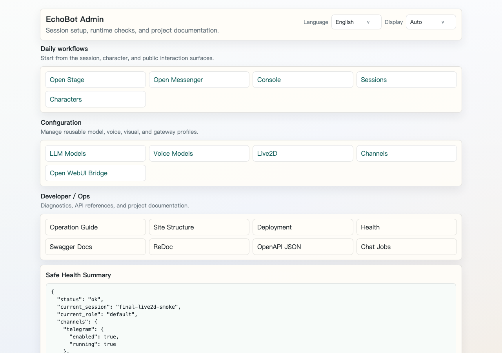
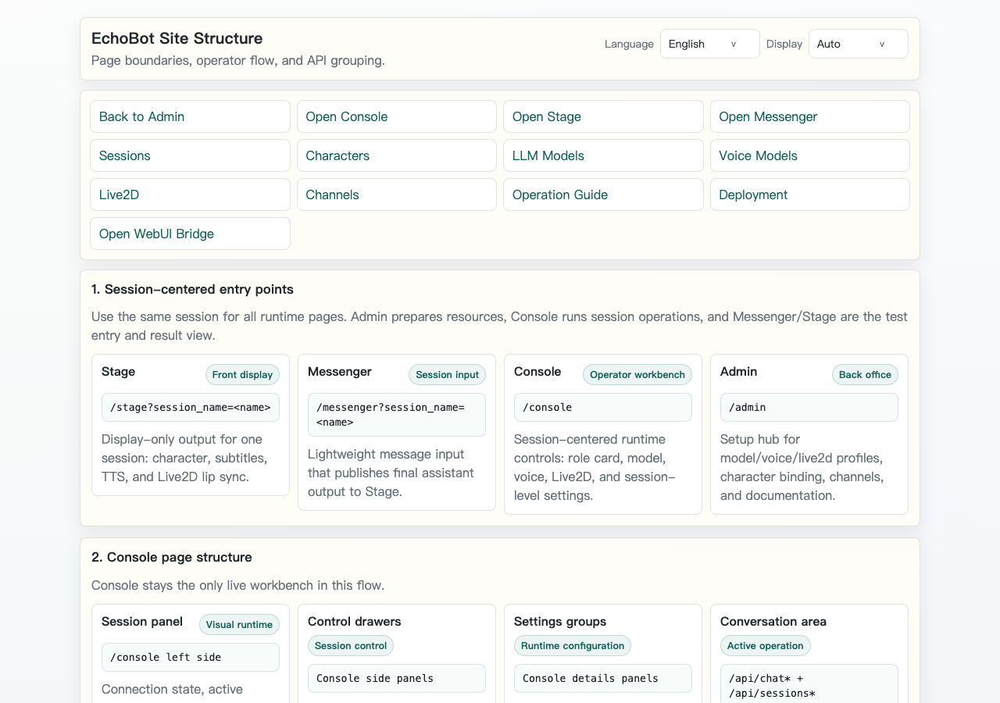
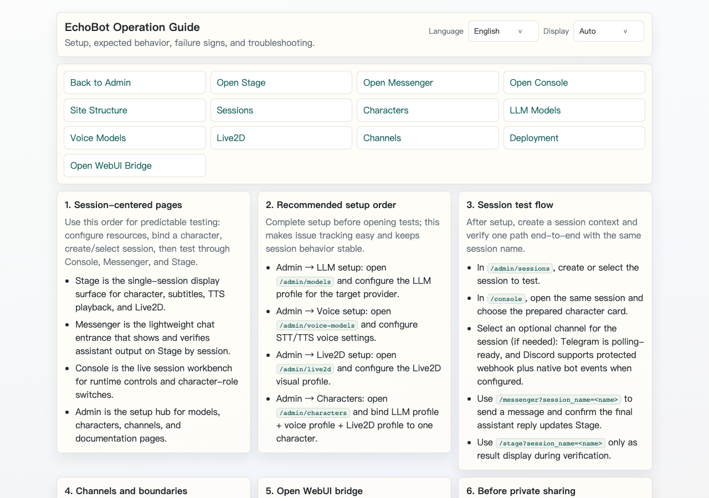
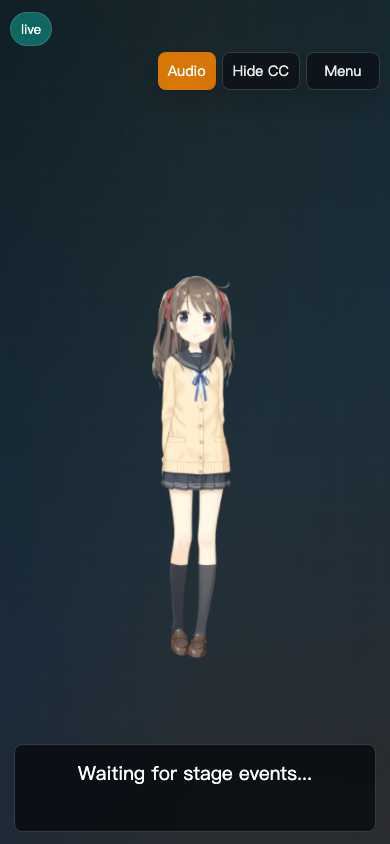

<div align="center">


</div>

# EchoBot Web Mobile Management Edition

[](https://www.python.org/downloads/)
[](https://opensource.org/licenses/MIT)

> Traditional Chinese version: [README.md](./README.md)

`moegundam/echobot-web-mobile` is a Web/Mobile management edition rebuilt on top of [KdaiP/EchoBot](https://github.com/KdaiP/EchoBot). This is not only a visual reskin: this fork turns the original mostly single `/web` operation surface into a local-development, mobile-testing, 10-user private-test, Stage, Messenger, Console, and Admin management build.

## How Much This Fork Changes

Based on the currently verifiable pages, APIs, tests, documentation, and smoke scripts, this fork adds or refactors **12 feature groups** compared with the original EchoBot, and fixes or tightens **9 categories of public-readiness issues**. This is counted by feature group, not by commit count, line diff, or individual button count.

### 12 Added Or Refactored Feature Groups

| # | Feature group | Description |
|---:|---|---|
| 1 | Stage frontend | `/stage` is now the formal interaction display for character, subtitles, TTS, Live2D, and stage state |
| 2 | Messenger entry | `/messenger` is an internal Web Chat that continues a Session without requiring manual bot/session text entry |
| 3 | Console operations | `/console` is the operator workbench, with `/web` compatibility and cross-page navigation |
| 4 | Admin backend | `/admin` now links guide, structure, deployment, models, voice, Live2D, characters, channels, and other setup pages |
| 5 | Session-centered runtime | Session drives character, model, voice, Live2D, channel entry, and conversation state resolution |
| 6 | Three-language i18n | English, Traditional Chinese, and Simplified Chinese switching for the main static and dynamic UI |
| 7 | Device/display modes | Auto, mobile, portrait, landscape, desktop/dense modes for phone, tablet, and desktop usability |
| 8 | Trusted-user namespace | Cloudflare Access / reverse-proxy trusted-header mode plus `.echobot/users/<user_id>` isolation |
| 9 | Stage Event Broker | user/session scoped SSE broker for subtitles, emotion, expression, motion, and Stage replay |
| 10 | Runtime profiles | LLM, Voice, and Live2D Admin pages; characters bind a full interaction config and support package import/export |
| 11 | Channel gateways | Telegram/Discord setup, smoke checks, stage target projection, and deterministic `/ping` verification |
| 12 | Open WebUI / deployment / CI | Narrow OpenAPI bridge, Docker package, deployment readiness, public safety scan, browser smoke, and CI verification |

### 9 Fixed Or Tightened Issue Categories

| # | Category | What changed |
|---:|---|---|
| 1 | Public information leakage | `/api/health` no longer exposes local absolute paths, and README avoids private hosts or tokens |
| 2 | Secret exposure | API keys, bot tokens, bridge tokens, and webhook secrets only expose configured status, never plaintext |
| 3 | Console/Admin responsibility split | Admin owns persistent setup; Console owns testing and temporary runtime overrides that can apply to Stage |
| 4 | Mixed model settings | `/admin/models` is LLM-only; Voice and Live2D moved to dedicated pages |
| 5 | Hardcoded language text | Main buttons, placeholders, status text, and dynamic copy moved into i18n |
| 6 | Session/platform confusion | Users primarily select Sessions; Channel is an entry point and metadata, not the core logic |
| 7 | Mobile/desktop layout issues | 360/390/430/768 viewports and desktop split operations were tightened |
| 8 | Unstable gateway tests | `/ping` / `/smoke` deterministic commands avoid relying on exact LLM output for E2E checks |
| 9 | Weak public-readiness verification | Added public safety scan, browser smoke, targeted tests, and GitHub Actions status checks |

## Screenshots

| Admin backend | Site structure |
|---|---|
|  |  |
| Operation guide | Mobile Stage |
|  |  |

## Upstream Sources And Attribution

| Type | Project | How this edition uses it |
|---|---|---|
| Upstream base | [KdaiP/EchoBot](https://github.com/KdaiP/EchoBot) | Main repository source for Agent/runtime/WebUI/Live2D/ASR/TTS/Channel foundations |
| Interaction reference | [Open-LLM-VTuber/Open-LLM-VTuber](https://github.com/Open-LLM-VTuber/Open-LLM-VTuber) | Reference only for Live2D, voice interaction, and VTuber UX; its backend is not merged |
| Original license | MIT License | The original `LICENSE` is preserved; original copyright belongs to KdaiP, and this fork's additions are maintained by `moegundam` |

Any future third-party project, model, asset, or document reference must state its source, license, and purpose in the README, the relevant documentation, or the asset directory.

EchoBot remains the implementation base. [Open-LLM-VTuber/Open-LLM-VTuber](https://github.com/Open-LLM-VTuber/Open-LLM-VTuber) is not merged into this backend. It is used only as a reference for Live2D, ASR/TTS, VTuber interaction design, and desktop-companion style UX.

## Feature Details

### 1. Layered Web Product Entrances

Original EchoBot mainly used `/web` as the operation page. This edition adds and organizes multiple product entrances:

| Page | Path | Purpose |
|---|---|---|
| Stage | `/stage?session_name=<name>` | Display-only character view, subtitles, TTS, and Live2D lip sync; can select a configured messaging target |
| Messenger | `/messenger` | Lightweight chat entry, defaulting to `chat_only`; can select configured Telegram/Discord targets instead of typing a session |
| Console | `/console` | Operator workbench, carrying the original `/web` control surface |
| Compatible Web | `/web` | Preserved legacy entry, mapped to Console |
| Admin | `/admin` | Admin index, health, API docs, jobs, and management pages |
| Operation Guide | `/admin/guide` | Operation, setup, expected outcomes, failure signs, and troubleshooting |
| Site Structure | `/admin/structure` | Route map, Console sections, and API namespace boundaries |
| Sessions | `/admin/sessions` | Create, inspect, and maintain Sessions; Session is the core entity for character, model, channel entry, and conversation state |
| Characters | `/admin/characters` | Manage role prompts, LLM / Voice / Live2D bindings, emotion maps, and character package import/export |
| LLM Models | `/admin/models` | Manage LLM provider, model, base URL, API key, and inference parameters |
| Voice Models | `/admin/voice-models` | Manage STT/TTS provider, voice, language, and voice profiles |
| Live2D | `/admin/live2d` | Manage Live2D selection, asset catalog, and visual profiles |
| Channels | `/admin/channels` | Telegram / Discord setup and smoke checks, plus QQ/LINE/WhatsApp gateway management entry |
| Open WebUI Bridge | `/admin/openwebui` | Narrow OpenAPI bridge instructions for Open WebUI |
| Deployment | `/admin/deployment` | Readiness checks for local service, Cloudflare, GitHub Actions, and the Open WebUI bridge |

### 2. Mobile And Desktop Display Modes

This edition adds consistent language and display controls:

- Languages: English, Traditional Chinese, Simplified Chinese.
- Display modes: Auto, Mobile, Portrait, Landscape, Desktop / Dense.
- Console, Stage, Messenger, and Admin pages share the same switching pattern.
- `/console` adapts its operation layout based on device and selected display mode.

### 3. Sitewide Language Switching

The original static DOM translation approach has been expanded to dynamic modules:

- ASR, TTS, sessions, roles, Live2D, traces, attachments, and messages refresh when the language changes.
- Most dynamic buttons, placeholders, titles, aria labels, status text, and error messages now use the shared i18n layer. New UI should follow the same pattern.
- The default language is English, with Traditional Chinese and Simplified Chinese available.

### 4. Cloudflare Local Tunnel Testing Deployment

A Local Tunnel profile was added for private testing: EchoBot runs locally or on a Mac host, while Cloudflare Tunnel + Access provides HTTPS and login.

Related files:

- [`docs/deployment/local-tunnel.md`](./docs/deployment/local-tunnel.md)
- [`docs/deployment/docker.md`](./docs/deployment/docker.md)
- [`docs/deployment/openwebui-stable-entry.md`](./docs/deployment/openwebui-stable-entry.md)
- [`docs/deployment/cloudflared-local-tunnel.example.yml`](./docs/deployment/cloudflared-local-tunnel.example.yml)
- [`.env.local-tunnel.example`](./.env.local-tunnel.example)

Recommended Local Tunnel command:

```shell
python -m echobot app --host 127.0.0.1 --port 8000
```

For local development, use another port when needed:

```shell
python -m echobot app --host 127.0.0.1 --port 8001
```

### 5. Cloudflare Access Trusted-User Boundary

This edition adds trusted-header support so private-test data can be isolated by logged-in identity:

- Default trusted user header: `Cf-Access-Authenticated-User-Email`
- When enabled, protected pages, API docs, `/api/*`, and the ASR WebSocket require a trusted user id.
- Sessions, history, jobs, attachments, and settings are stored under `.echobot/users/<user_id>/...`.
- Different users should not see each other's sessions, history, jobs, attachments, or Stage events.
- `ECHOBOT_ADMIN_ALLOWLIST` can restrict high-risk mutation APIs for runtime, channels, roles, and LLM/voice/Live2D profiles.

### 6. Stage Event Broker

A user/session scoped Stage event flow was added:

- `GET /api/stage/events?session_name=<name>`: subscribe to Stage events over SSE.
- `POST /api/stage/events`: publish subtitles and stage events.
- Broker v1 is in-memory and keyed by trusted user plus session.
- Stage updates subtitles on `assistant_delta` and performs final subtitle/TTS behavior on `assistant_final`.
- Stage events can carry `emotion`, `expression`, and `motion`; `character_state` can update Live2D expression/motion without changing subtitles.
- `/admin/characters` can maintain an emotion map per character; when an event only provides `emotion` and the session has a bound role, the backend fills the mapped Live2D `expression` / `motion`.

### 7. Open WebUI Bridge Interface

The EchoBot-side narrow bridge and local smoke path are implemented. External Open WebUI usage still needs a bridge token and a trusted network entrypoint:

- `GET /api/openwebui/tools/openapi.json`
- `GET /api/openwebui/sessions`
- `POST /api/openwebui/stage/events`
- `POST /api/openwebui/chat`

Security design:

- The bridge uses a server-to-server Bearer token.
- The full site `/openapi.json` is not exposed to Open WebUI.
- By default, bridge calls require `target_user_id` or `ECHOBOT_OPENWEBUI_BRIDGE_USER_ID` so they do not write into the shared root runtime.
- `ECHOBOT_OPENWEBUI_ALLOWED_TARGET_USERS` can restrict which user namespaces the bridge may target.
- The default route mode is `chat_only`.
- Operator-agent mode must be explicitly enabled before higher-risk routing is allowed.

### 8. Runtime Profiles: LLM, Voice, And Live2D Pages

Runtime model configuration is split across three Admin pages so model, voice, and visual settings do not get mixed into one confusing profile:

- `/admin/models`: manages only LLM / chat model provider, model, base URL, API key, and inference parameters.
- `/admin/voice-models`: manages STT/TTS provider, model, voice, language, base URL, and API key.
- `/admin/live2d`: manages Live2D selection, available catalog entries, and visual profiles.
- `/admin/characters`: binds LLM, Voice, and Live2D into a complete character interaction unit.
- `/console`: can make temporary runtime overrides for the selected session. Console changes do not overwrite Admin profiles, but they can be applied to Stage.

### 9. Character Packages

`/admin/characters` can export and import one character package:

- Exports include the role prompt, LLM / Voice / Live2D bindings, emotion map, and a non-sensitive model settings snapshot.
- Exports do not include API keys, bot tokens, Cloudflare/Open WebUI tokens, or `.echobot/` secrets.
- Imports can use a new character name or overwrite an existing character.
- v1 uses JSON packages and does not bundle Live2D asset files; model API keys are still filled from `/admin/models`.

### 10. Channels Admin Page

`/admin/channels` has been upgraded from a read-only planning page into a messaging-platform setup entry:

- Telegram can store enabled state, allow list, bot token, proxy, reply-to-message behavior, and whether pending updates are dropped on startup.
- Discord can store enabled state, allow list, bot token, webhook URL, webhook secret, application/guild/channel ids. It currently supports the secret-protected `POST /api/channels/discord/webhook` inbound bridge, outbound webhook delivery, and native Discord bot events after `discord.py` is installed and Message Content Intent is enabled.
- Secret fields only expose configured status in the API and UI; plaintext values are never returned.
- `POST /api/channels/{channel}/smoke` provides safe local readiness checks without echoing tokens in responses.
- `scripts/telegram_gateway_smoke.py` and `scripts/discord_gateway_smoke.py` rerun gateway checks. Plain text validates session history, while deterministic `/ping` / `/smoke` commands validate Stage replay because those commands do not write normal conversation history.
- `GET /api/channels/stage-targets` exposes a secret-free messaging target list so `/stage` and `/messenger` can select the Stage session bound to a configured platform.
- Telegram Bot API `getMe`, poller startup, Bot API outbound, session binding, and Stage target projection have a repeatable smoke path. Real bot tokens must stay in repo-external ignored runtime config.
- Production messaging gateways can set `mirror_to_stage` and `stage_session_name`; the maintainer environment has verified Telegram `/ping TG_OK` inbound reply and `/stage` mirroring.
- The Discord webhook bridge can receive secret-protected local or reverse-proxy inbound requests. The native Discord bot events adapter is implemented, and the maintainer environment has verified Discord `/ping DISCORD_OK` gateway reply and `/stage` mirroring. Production still requires a repo-external bot token, Discord Developer Portal Message Content Intent, and an EchoBot restart.
- Messaging gateways include deterministic `/ping <text>` / `/smoke <text>` smoke commands so platform E2E tests do not depend on LLM exact-output obedience.

### 11. Deployment And Architecture Documentation

This edition adds planning, site structure, and reference documents:

- [`docs/implementation/echobot-web-mobile-integration-plan.md`](./docs/implementation/echobot-web-mobile-integration-plan.md)
- [`docs/implementation/echobot-web-page-links.md`](./docs/implementation/echobot-web-page-links.md)
- [`docs/implementation/echobot-web-site-structure.md`](./docs/implementation/echobot-web-site-structure.md)
- [`docs/implementation/open-llm-vtuber-reference-gap.md`](./docs/implementation/open-llm-vtuber-reference-gap.md)

## Current Status And Public-Repo Notes

Completed so far:

- The EchoBot base has been organized into a Web/Mobile management edition while preserving the compatible `/web` entry.
- `/stage`, `/messenger`, `/console`, `/admin`, and the Admin guide/structure/models/Open WebUI/channels pages have been added.
- English, Traditional Chinese, and Simplified Chinese switching is applied to static pages and the main dynamic UI.
- Mobile/tablet/desktop display modes have been added, with 360x800, 390x844, 430x932, and 768x1024 viewport checks expected to avoid horizontal overflow.
- First-version interfaces and documentation exist for Cloudflare Local Tunnel, trusted-user isolation, Stage Event Broker, Open WebUI bridge APIs, LLM / Voice / Live2D profiles, Character Packages, and Channels setup/smoke checks.
- Telegram / Discord E2E in the maintainer environment, Voice TTS/ASR smoke, and Open WebUI bridge smoke from both local EchoBot and a remote Open WebUI host over a reverse tunnel have passed.
- Console/Admin UX has been tightened: route mode no longer shows raw enum values, Messenger uses the Session route mode, Stage/Messenger include cross-surface navigation, and Open WebUI/Channels show repeatable entrypoint and verified-platform status.
- The public-facing safety default is now `ECHOBOT_SHELL_SAFETY_MODE=workspace-write`.

Not finished or still planned:

- LINE and WhatsApp production runtime adapters remain planned; the QQ adapter still has a built-in entry but has not had a long-running real-platform check.
- The EchoBot-side narrow Open WebUI bridge API, documentation page, and local smoke script exist. A remote Open WebUI host has been verified through an SSH reverse tunnel for tool spec, stage events, and chat. `scripts/echobot_entrypoint.py` can run the local app and reverse tunnel under macOS launchd and rerun bridge smoke checks. Cloudflare Tunnel / Access remains the formal HTTPS entrypoint.
- `/admin` v1 is mostly an index, guide, and status surface. It is not a complete production SaaS admin console.
- Stage / Live2D / ASR / TTS have v1 integration and local smoke coverage. Real-device microphone and long-running voice interaction checks still need HTTPS plus real-device validation.
- Multi-user private testing should use Cloudflare Access or a trusted reverse proxy. Do not expose the local service anonymously to the public internet.

A public repository means the code and documentation are browseable. It does not mean this system is safe to deploy anonymously. Before internet deployment, read [`SECURITY.md`](./SECURITY.md) and enable the trusted-user security boundary.

## Quick Start

### 1. Install Dependencies

Python 3.11 or newer is recommended.

```shell
python -m venv .venv
source .venv/bin/activate
pip install -r requirements.txt
```

### 2. Create Configuration

```shell
cp .env.example .env
```

Common OpenAI-compatible configuration:

```text
LLM_API_KEY=your_api_key_here
LLM_MODEL=your-model-name
LLM_BASE_URL=https://your-provider.example/v1
```

Configure local models, remote private model services, and API keys in your own `.env` file or secret manager. Do not put real hosts, tailnet IPs, model inventories, or keys into a public repository.

### Model And CUDA Deployment Strategy

The EchoBot Docker image is a lightweight app runtime by default. It does not bundle LLM weights or a CUDA runtime. For GB10, LiteLLM, Ollama, vLLM, or another GPU provider, run that provider separately and connect EchoBot through an OpenAI-compatible endpoint. EchoBot should focus on sessions, characters, Stage, Messenger, Console, Admin, and channel gateways.

### 3. Start The Local Server

```shell
python -m echobot app --host 127.0.0.1 --port 8000
```

If port 8000 is already in use:

```shell
python -m echobot app --host 127.0.0.1 --port 8001
```

### Docker / Compose Startup

This edition also provides an upgraded single-container package:

```shell
cp docker.env.example docker.env.local
docker compose build
docker compose up -d
curl -fsS http://127.0.0.1:8000/api/health
```

GitHub Container Registry image:

```text
ghcr.io/moegundam/echobot-web-mobile:upgrade
```

See [`docs/deployment/docker.md`](./docs/deployment/docker.md) for details.

### 4. Open The Pages

```text
http://127.0.0.1:8000/console
http://127.0.0.1:8000/stage?session_name=demo
http://127.0.0.1:8000/messenger
http://127.0.0.1:8000/admin
```

## Tests

```shell
python -m pytest
```

This branch has repeatable verification for:

- Browser smoke for the main routes across mobile/tablet/desktop viewports.
- i18n key coverage and HTML translatable attribute checks.
- API route/auth tests.
- Browser smoke: `scripts/browser_smoke.py --base-url http://127.0.0.1:8001`.
- Public safety scan: `scripts/check_public_safety.py`.
- Full pytest / CI: `363 passed, 2 warnings`.

## Project Rules

1. Preserve the upstream EchoBot MIT License and copyright.
2. Any third-party source used by README, docs, assets, models, or code must state its source, license, and purpose.
3. Secrets must not be committed, including LLM keys, Cloudflare tokens, Open WebUI bridge tokens, and chat platform bot tokens.
4. Private testing should use Cloudflare Access or a trusted reverse proxy first; do not expose the system anonymously by default.
5. `/messenger` and external chat gateways default to `chat_only`; tool-capable Agent behavior needs a separate approval gate.
6. User data is stored under `.echobot/users/<user_id>/...` by default and must not be mixed across users.
7. New pages must support English, Traditional Chinese, and Simplified Chinese.
8. Major features need documentation and tests, with at least one rerunnable minimum verification path.

## License

This project follows the MIT License. See [`LICENSE`](./LICENSE). The upstream EchoBot copyright remains KdaiP's, and this fork's additional modifications are marked under `moegundam` in the same MIT license file.

MIT permits use, modification, distribution, sublicensing, and sale, so this project can be used in commercial products or apps. Distributed copies must preserve the MIT license text and copyright notice, and third-party assets, models, and platform terms still need separate review.

License notices:

```text
Copyright (c) 2026 KdaiP
Additional modifications Copyright (c) 2026 moegundam
```
