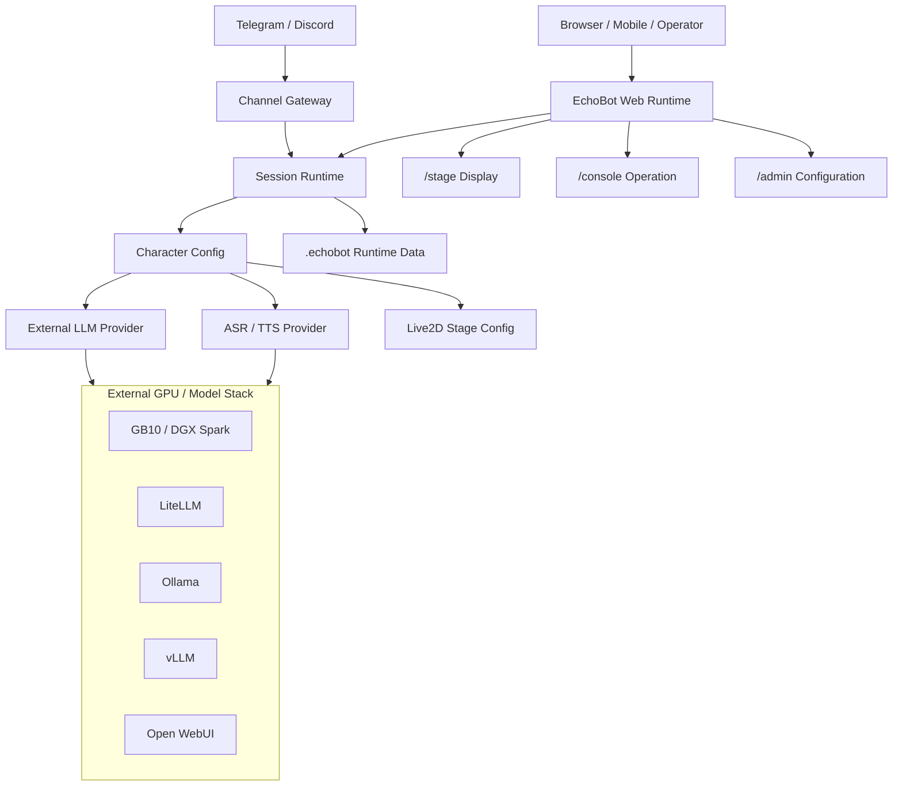

# EchoBot Architecture, Code Cleanliness, And CUDA Audit - 2026-06-02

## 中文版

### 目標

確認 EchoBot 目前架構與程式碼是否足夠乾淨、可維護，並確認 NVIDIA CUDA / GB10 類 GPU 使用方式是否符合輕量、高效、好維護的方向。

### 本次結論

- EchoBot 應維持 `app-only` web/runtime container：負責 Session、Character、Stage、Messenger、Console、Admin、channel gateway。
- LLM / GPU inference 建議外部化：GB10、LiteLLM、Ollama、vLLM、Open WebUI 或其他 OpenAI-compatible provider 應作為獨立服務。
- 目前 repo 沒有內建 CUDA runtime、NVIDIA Container Runtime、GPU compose 設定或 GPU Python dependency；這是刻意輕量化設計，不是 CUDA 最佳化完成的證明。
- 若要驗證 CUDA 效能最佳化，應在 GPU provider 主機上驗證，而不是只看 EchoBot container。
- 本輪發現一個公開前必修項：URL/下載防護需要 DNS 解析後阻擋私網位址。已補強並加測試。

### 目前架構

### CUDA / NVIDIA 狀態

| 檢查面 | 現況 | 判斷 |
|---|---|---|
| Dockerfile | Python app runtime，沒有 CUDA/NVIDIA runtime | 符合輕量 app container 策略 |
| Compose | 沒有 `gpus:` 或 NVIDIA runtime 設定 | GPU 不在 EchoBot container 內執行 |
| Python dependencies | 沒有 `torch`、`onnxruntime-gpu`、CUDA package | 本 repo 不做內建 CUDA 推理 |
| LLM | OpenAI-compatible provider | 可接 LiteLLM / Ollama / vLLM / GB10 |
| ASR/TTS/VAD | Sherpa/Kokoro/Silero 具 provider 參數，預設 `cpu` | 可本機語音測試，但非 CUDA 最佳化狀態 |
| 文件 | 已補 Docker runtime mode 與 GPU strategy | 公開說明更清楚 |

### 已修正

| ID | 類型 | 修正 |
|---|---|---|
| F1 | SSRF / URL policy | URL validator 現在會解析 hostname，DNS 解析到 loopback、link-local、private 或其他 non-global IP 時拒絕。 |
| F2 | Private artifact mirror | ASR/TTS/VAD 模型下載預設仍拒絕私網；只有明確設定 `ECHOBOT_*_ALLOW_PRIVATE_DOWNLOAD=true` 才允許。 |
| F3 | Public docs hygiene | 安全掃描紀錄中的真實外部掃描主機與遠端暫存路徑已改成 placeholder。 |
| F4 | CUDA strategy docs | README、Docker deployment docs、Compose 註解已明確寫出 app-only container 與外部 GPU provider 策略。 |

### 可等待的整理項

| Priority | 項目 | 建議 |
|---|---|---|
| P2 | URL/security helper 放在 `echobot/speech_assets.py`，但已被非 speech 模組引用 | 後續可移到 `echobot/security/http.py` 或 `echobot/net/http_policy.py`，降低模組語意耦合。 |
| P2 | docx/pptx/xlsx office redline helper/validator 有重複拷貝 | 後續可抽到共用 office helper，或保留 vendor-like skill 分包但加同步測試。 |
| P3 | smoke scripts 內有重複的 URL parser | 後續可抽成 `scripts/_common.py`。 |
| P3 | QQ channel attachment download 有局部重複 | 後續可抽一個 private helper，先保持行為穩定。 |
| P3 | `requirements-memory.txt` 是 comment-only placeholder | 保留可以，但文件要持續說明 memory stack 暫停原因。 |

### NVIDIA / GB10 後續驗證方式

要確認 CUDA 真的有效，應在外部 GPU provider 主機做下列驗證：

1. 確認 NVIDIA driver / container runtime / framework support。
2. 確認 provider endpoint 可從 EchoBot 連到。
3. 用同一個 prompt / ASR / TTS request 比較 CPU 與 GPU provider latency。
4. 在 EchoBot 端只驗證 OpenAI-compatible request/response、streaming、Stage mirror、TTS/ASR route 是否正常。

參考官方文件：

- NVIDIA DGX Spark documentation: <https://docs.nvidia.com/dgx/dgx-spark/>
- NVIDIA DGX Spark build examples: <https://docs.nvidia.com/dgx/dgx-spark/advanced/build-examples.html>
- NVIDIA Container Toolkit: <https://docs.nvidia.com/datacenter/cloud-native/container-toolkit/latest/>

## English version

### Goal

Verify whether EchoBot's current architecture and code are clean and maintainable enough, and whether the NVIDIA CUDA / GB10 GPU strategy is aligned with a lightweight, efficient, maintainable deployment model.

### Current Conclusion

- EchoBot should remain an `app-only` web/runtime container responsible for Session, Character, Stage, Messenger, Console, Admin, and channel gateways.
- LLM / GPU inference should stay external: GB10, LiteLLM, Ollama, vLLM, Open WebUI, or another OpenAI-compatible provider should run as separate services.
- This repo currently does not include a CUDA runtime, NVIDIA Container Runtime, GPU Compose configuration, or GPU Python dependencies. That is a lightweight app-container design, not proof that CUDA inference has been optimized.
- CUDA performance validation belongs on the GPU provider host, not inside the EchoBot app container.
- One pre-publication must-fix was found: URL/download protection needed DNS-resolution-aware private-network blocking. It has been fixed and tested.

### Current Architecture

### CUDA / NVIDIA Status

| Check Area | Current State | Judgment |
|---|---|---|
| Dockerfile | Python app runtime, no CUDA/NVIDIA runtime | Matches the lightweight app-container strategy |
| Compose | No `gpus:` or NVIDIA runtime setting | GPU inference does not run inside the EchoBot container |
| Python dependencies | No `torch`, `onnxruntime-gpu`, or CUDA package | This repo does not embed CUDA inference |
| LLM | OpenAI-compatible provider | Can connect to LiteLLM / Ollama / vLLM / GB10 |
| ASR/TTS/VAD | Sherpa/Kokoro/Silero expose provider parameters, defaulting to `cpu` | Useful for local speech testing, not a CUDA-optimized state |
| Documentation | Docker runtime modes and GPU strategy were added | Public explanation is clearer |

### Fixed In This Pass

| ID | Type | Fix |
|---|---|---|
| F1 | SSRF / URL policy | The URL validator now resolves hostnames and rejects DNS results that point to loopback, link-local, private, or other non-global IPs. |
| F2 | Private artifact mirror | ASR/TTS/VAD model downloads still reject private networks by default; only explicit `ECHOBOT_*_ALLOW_PRIVATE_DOWNLOAD=true` settings allow them. |
| F3 | Public docs hygiene | Real external scan host and remote temporary scan path details were replaced with placeholders in the security scan record. |
| F4 | CUDA strategy docs | README, Docker deployment docs, and Compose comments now state the app-only container plus external GPU provider strategy. |

### Deferred Cleanup

| Priority | Item | Recommendation |
|---|---|---|
| P2 | URL/security helper lives in `echobot/speech_assets.py`, but non-speech modules now import it | Later move it to `echobot/security/http.py` or `echobot/net/http_policy.py` to reduce semantic coupling. |
| P2 | docx/pptx/xlsx office redline helpers/validators are copied across packages | Later extract common office helpers, or keep vendor-like skill packages but add parity tests. |
| P3 | smoke scripts duplicate URL parser snippets | Later extract `scripts/_common.py`. |
| P3 | QQ channel attachment download has local duplication | Later extract one private helper while preserving behavior. |
| P3 | `requirements-memory.txt` is a comment-only placeholder | Keep it only if the docs continue to explain why the memory stack is disabled. |

### NVIDIA / GB10 Follow-Up Validation

To prove CUDA is actually effective, validate it on the external GPU provider host:

1. Confirm NVIDIA driver / container runtime / framework support.
2. Confirm the provider endpoint is reachable from EchoBot.
3. Compare CPU and GPU provider latency using the same prompt / ASR / TTS request.
4. In EchoBot, verify only OpenAI-compatible request/response, streaming, Stage mirroring, and TTS/ASR routing.

Official references:

- NVIDIA DGX Spark documentation: <https://docs.nvidia.com/dgx/dgx-spark/>
- NVIDIA DGX Spark build examples: <https://docs.nvidia.com/dgx/dgx-spark/advanced/build-examples.html>
- NVIDIA Container Toolkit: <https://docs.nvidia.com/datacenter/cloud-native/container-toolkit/latest/>
