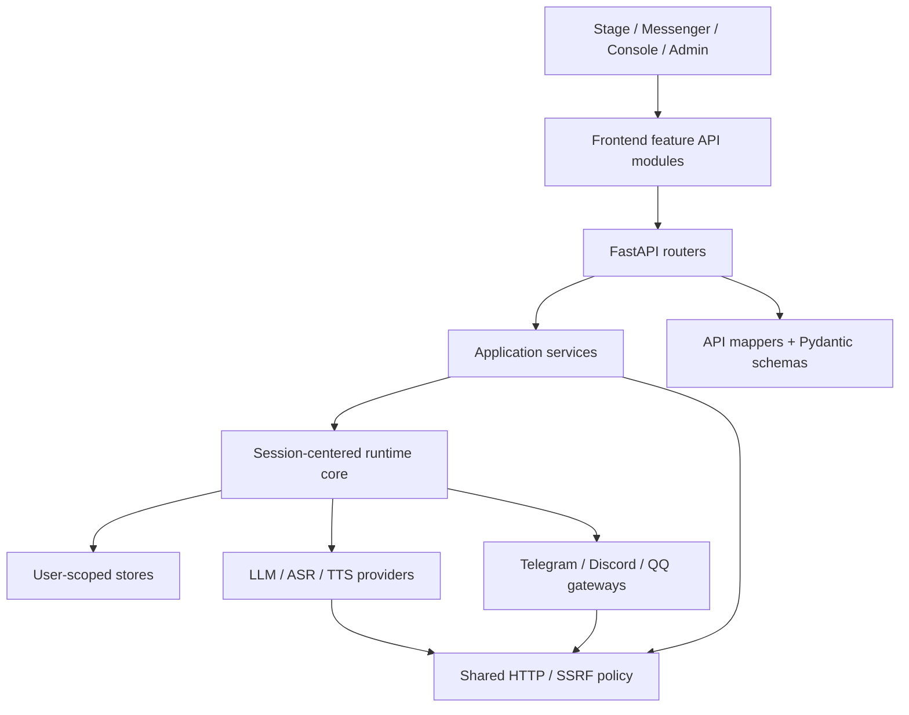
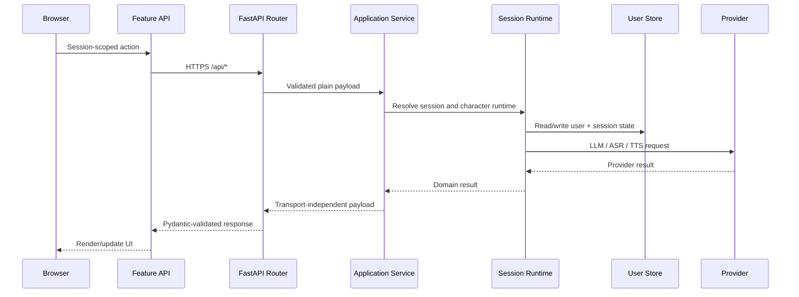

# EchoBot Modular API Architecture Review / EchoBot 模組化與 API 架構檢視

## 中文版

### 檢視範圍

- 本機正式工作樹：`echobot-web-mobile`
- 檢視基準 HEAD：`9e4309474971e368ad00b54da4766bed1a8de147`
- 工作樹狀態：dirty，包含尚未提交的本機開發內容
- GitHub 狀態：本輪未 commit、未 push、未開 PR、未同步
- 來源產生清單：119 個 FastAPI operations、94 個 Pydantic classes、274 個 Python modules、202 個 Web assets、42 個 test files

### 結論

EchoBot 已經是 API-centered 系統，不需要重寫底層框架。FastAPI、目前的 runtime core 與原生 ES modules 適合本機優先、單機服務與小規模內測；本輪修正的是實際的跨層耦合、event-loop 阻塞與重複 transport policy。

不採用 React/bundler 或資料庫重寫，原因是目前沒有能抵銷遷移成本的效能證據。若未來進入多 worker、多主機或大型團隊協作，再分別評估 Redis/PostgreSQL 與前端 build pipeline。

### 目前模組邊界

### 主要責任

| 層 | 主要模組 | 責任 |
| --- | --- | --- |
| Assembly | `echobot/app/create_app.py` | 建立 FastAPI app、middleware、router 與靜態頁面；不放業務流程 |
| HTTP contract | `echobot/app/routers/` | 解析 request、權限 dependency、HTTP error mapping、response model |
| API mapping | `echobot/app/mappers.py`, `echobot/app/schemas.py` | Domain-to-API mapping 與 Pydantic contracts；schemas 不再負責資料存取或 secret redaction |
| Application | `session_application.py`, `character_profile_application.py`, `runtime_catalog_application.py`, `deployment_status.py` | 跨服務 use case、跨 store mutation、非阻塞 orchestration |
| Runtime | `echobot/runtime/`, `echobot/orchestration/` | Session、Decision / Roleplay / Agent、conversation state |
| Persistence | `user_scoped_runtime.py`, repositories、session/attachment stores | user/session scope 與持久化 |
| Provider | `echobot/providers/`, `echobot/asr/`, `echobot/tts/` | 模型與語音 provider adapters |
| Channel | `echobot/channels/`, `echobot/gateway/` | 外部平台只作 Session entry point |
| Network policy | `echobot/network/http.py` | HTTP URL validation、private-network SSRF policy、受控 URL open |
| Frontend transport | `web/modules/api.js`, `web/features/stage/api.js`, session feature API | JSON、upload、chat stream 與 Stage transport；頁面 entrypoint 負責組裝 UI |

### 本輪修正

1. 將通用 HTTP/SSRF policy 從 `speech_assets.py` 移到 `echobot/network/http.py`。
2. LLM、Discord、QQ、TTS 與 Web fetch tool 共用同一 private-network 判斷。
3. 六個 Admin 頁面與其他入口共用 `web/modules/api.js` 的 JSON/error policy。
4. Messenger 共用 attachment upload、JSON、chat stream transport，並保留 `AbortSignal`。
5. Stage 的 EchoBot HTTP calls 移到 `web/features/stage/api.js`；SSE、WebSocket、音訊與外部 Live2D asset 仍維持各自 transport。
6. `CharacterProfileSettingsService.settings_for_roles()` 將角色列表由每角色多次 JSON 讀取改成一次一致快照。
7. `DeploymentStatusService` 將 Git、cloudflared、workflow file probes 放到 `asyncio.to_thread`，不阻塞 FastAPI event loop。
8. Character create/update/import/delete 改由 `CharacterProfileApplicationService` 管理跨 store 流程。
9. Runtime model delete 與 Console runtime override 改由 `RuntimeCatalogApplicationService` 管理跨 store 流程。
10. Model services 改回傳 plain payload，不再建立 Pydantic model 後立刻 `model_dump()`。
11. Session/domain mapping 移到 `app/mappers.py`；Channel secret redaction 移到 `services/channel_config.py`。

### 資料流

### 效率證據

- Character router：601 行降為 290 行；mutation workflow 移到 application service。
- Deployment router：原本約 266 行的 probe/組裝邏輯降為 19 行；blocking probes 完整移出 event loop。
- Messenger entrypoint：869 行降為 762 行；移除重複 upload 與 NDJSON parser。
- Character settings list：同一 request 只讀一次 JSON store。
- Model projection：移除 application service 內不必要的 Pydantic object 建立與 dump。
- 完整測試：543 passed、0 failed。
- 最新程式圖索引：7,447 個節點、26,722 條關係；application service、shared network policy 與 shared frontend transport 均形成可辨識的重用邊界。

### 延後項目

- `stage-app.js` 仍是大型 composition module；之後可按 Live2D runtime、viewport controller、TTS playback、SSE event controller 分拆。現有功能與 transport 已有邊界，沒有證據要求立即重寫。
- `schemas.py` 目前含 94 個 contract classes；可按 sessions/chat/models/web 分檔，但這是維護性工作，不是目前 runtime bottleneck。
- 多 worker 或多主機部署前，Stage event broker 與本機 JSON stores 需評估 Redis/PostgreSQL；目前單機/local tunnel 不必先承擔該複雜度。

## English version

### Scope And Result

The source-derived inventory contains 119 FastAPI operations, 94 Pydantic classes, 274 Python modules, 202 web assets, and 42 test files. EchoBot is already API-centered. The existing FastAPI runtime and native ES modules remain the lower-cost architecture for local-first and small private deployments.

This review fixed concrete ownership and performance issues instead of replacing the stack: blocking probes now run off the event loop, character settings use one consistent snapshot, cross-store mutations live in application services, runtime model services return plain payloads, HTTP/SSRF policy has one owner, and frontend entrypoints share transport modules.

### Verification

- Full regression: 543 passed, 0 failed.
- JavaScript syntax: all web JavaScript modules pass `node --check`.
- API inventory remains at 119 operations after refactoring.
- Fresh architecture graph: 7,447 nodes and 26,722 relationships; application services and shared transport/policy modules are visible reuse boundaries.
- GitHub was not modified; all work remains local and uncommitted.

### Deferred Work

- Split the Stage composition module only when the next Live2D/TTS/SSE change provides a concrete extraction boundary.
- Split Pydantic contracts by domain when schema ownership becomes a team bottleneck.
- Evaluate Redis/PostgreSQL before multi-worker or multi-host deployment, not for the current single-host profile.
