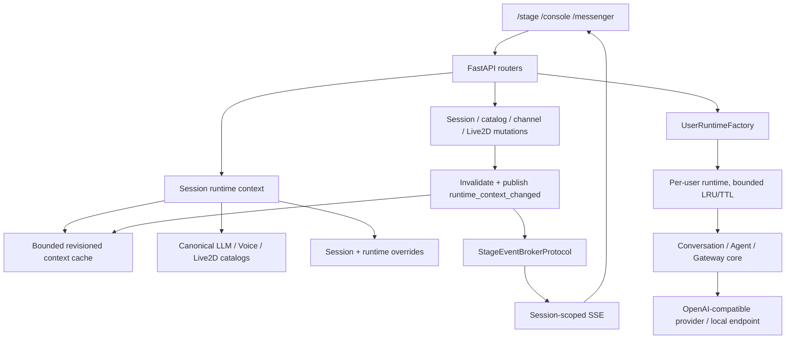

# EchoBot Modular Runtime Foundation

## 中文版

### 文件範圍

- 文件日期：2026-07-20。
- 記錄目前模組化 runtime foundation 的實作邊界、資料流、設定與驗證方式。
- Production runtime 仍以 `.echobot/` file-backed stores 為主。
- PostgreSQL importer、真 Redis 多程序驗收與公開部署不在已完成範圍。

### 架構與資料流



### 模組責任

| 模組 | 責任 | 不負責 |
|---|---|---|
| `echobot/app/routers/` | HTTP auth、schema、status code、route composition | 跨 request 的 domain state |
| `session_runtime_context.py` | 由 Session 組合角色、模型、語音、Live2D、channel projection | 寫入 secrets |
| `runtime_context_cache.py` | per-runtime bounded LRU、revision、同 key build coalescing | 跨 process cache |
| `runtime_context_events.py` | mutation 後 invalidate 並發布 Stage change event | 回滾已提交 mutation |
| `runtime_model_repositories.py` | canonical LLM、Voice、Live2D JSON stores | reverse-write legacy profiles |
| `model_profile_compat.py` | 從 canonical stores 投影舊 API shape | 作為新的寫入來源 |
| `user_runtime_factory.py` | user runtime 建立、dedupe、LRU、idle TTL、停止 | tenant policy 或 auth decision |
| `stage_event_broker_factory.py` | memory/Redis selector 與 fail-closed validation | 靜默 fallback |
| `echobot/runtime/` | Session repository protocol、JSONL/SQLite backend、migration | PostgreSQL runtime adapter |

### Canonical runtime stores

- LLM：`.echobot/llm_models.json`；secret sidecar：`.echobot/llm_model_secrets.json`。
- Voice：`.echobot/voice_profiles.json`；secret sidecar：`.echobot/voice_profile_secrets.json`。
- Live2D：`.echobot/live2d_models.json`。
- Session/Agent session：`.echobot/sessions/`、`.echobot/agent_sessions/` 或 SQLite files。
- `model_profiles.json` 只作一次性 seed/legacy compatibility input；canonical repository 不再 reverse-write 它。
- 舊 combined model API 可由 `model_profile_compat.py` 產生 read projection；新 UI/API 應使用 LLM、Voice、Live2D 分離 endpoints。
- secret value 不進 compatibility projection、runtime context response 或 migration seed；只可表達 `api_key_configured` 等狀態。

### User runtime lifecycle

- `UserRuntimeFactory` 以 user storage key 建立 runtime；同一 user 的 concurrent requests 共用 in-flight build。
- 不同 user 的 build 可並行；停止操作在 lock 外執行，避免阻塞其他 user。
- 預設最多保留 16 個 runtime，idle TTL 預設 1800 秒。
- 可用環境變數調整：

```text
ECHOBOT_USER_RUNTIME_MAX_ENTRIES=16
ECHOBOT_USER_RUNTIME_IDLE_TTL_SECONDS=1800
```

- max entries 必須為正數；idle TTL 必須為非負數，`0` 表示下一次 cache access 時立即淘汰 idle runtime。無效值會 fail fast。
- Session runtime-context cache 每個 process 預設最多 256 筆；目前是 code-level constructor option，尚未提供 env selector。
- LRU eviction 與 idle cleanup 會停止被淘汰 runtime；`stop_all()` 用於 app shutdown。

### Stage broker 與多 worker 規則

- `ECHOBOT_STAGE_BROKER=memory`：目前預設；bounded history/queue/channel。
- `ECHOBOT_STAGE_BROKER=redis`：使用 Redis Streams；必須同時提供 `ECHOBOT_STAGE_REDIS_URL`。
- memory broker 在 `ECHOBOT_STAGE_WORKER_COUNT`、`WEB_CONCURRENCY` 或 `UVICORN_WORKERS` 大於 1 時拒絕啟動。
- Redis 未設定 URL、unknown backend、invalid positive limits 都拒絕啟動；不會切回 memory。
- 主要設定：

```text
ECHOBOT_STAGE_BROKER=memory
ECHOBOT_STAGE_WORKER_COUNT=1
ECHOBOT_STAGE_REDIS_URL=redis://127.0.0.1:6379/0
ECHOBOT_STAGE_HISTORY_LIMIT=100
ECHOBOT_STAGE_QUEUE_LIMIT=100
ECHOBOT_STAGE_MAX_CHANNELS=256
ECHOBOT_STAGE_HEARTBEAT_SECONDS=15
ECHOBOT_STAGE_REDIS_TTL_SECONDS=86400
ECHOBOT_STAGE_REDIS_READ_BLOCK_MS=1000
ECHOBOT_STAGE_REDIS_STREAM_KEY_PREFIX=echobot:stage-events
```

- Stage scope 是 user storage key + normalized session name。
- event text 上限 8192 bytes、metadata JSON 上限 4096 bytes、directive 上限 256 chars。
- SSE heartbeat 預設 15 秒；history 與 subscriber queue 預設各 100；queue 滿時丟最舊事件。
- Redis stream key 使用 user/session 的 SHA-256 components，不把原始 email 或 session name 放入 key。
- Redis foundation 有 fake-client contract tests；真 Redis 的兩程序 publish/subscribe、reconnect、load、TTL 與 isolation 仍是部署 gate。

### Revisioned runtime context、SSE 與 ETag

1. GET runtime context 先由 Session runtime composer 解析依賴。
2. bounded cache 以 session key coalesce concurrent build，並產生 `ctx-XXXXXXXX-XXXXXXXX` revision。
3. 成功 mutation 後先 invalidate，再發布 `runtime_context_changed`。
4. Stage 收到 event 後以 revision refresh；同 revision 不重載 Live2D，不觸發 TTS。
5. `GET /api/sessions/{session_name}/runtime-context` 回傳 `ETag`，支援 `If-None-Match`；命中時回 `304`。
6. ETag 也包含 access role，並回傳 `Cache-Control: private, no-cache` 與 `Vary: Authorization`。

```json
{
  "kind": "runtime_context_changed",
  "session_name": "demo",
  "text": "",
  "source": "runtime",
  "metadata": {
    "revision": "ctx-00000000-00000001",
    "reason": "llm_catalog_updated",
    "schema_version": 1
  }
}
```

- `text` 必須為空，避免舊 Stage 把 context event 當字幕/TTS。
- 目前已接線的主要 mutation path 包含 LLM、Voice、Live2D catalog、channel config、角色 mutation 與 Live2D asset mutation。
- Session create/rename/role/route/channel binding 等 lifecycle path 仍應以 wiring tests 持續核對，不能只依賴 cache helper 存在。
- publish 失敗不回滾已提交資料；錯誤會記錄 log，後續可加入 outbox/retry。

### 驗證指令

```bash
.venv/bin/python -m pytest tests/test_runtime_composition.py tests/test_user_runtime_factory_lifecycle.py
.venv/bin/python -m pytest tests/test_stage_event_broker_factory.py tests/test_runtime_context_cache.py
.venv/bin/python -m pytest tests/test_runtime_model_canonical_store.py tests/test_session_repository.py tests/test_session_migration.py
.venv/bin/python -m pytest
git diff --check
```

確認 memory broker 的多 worker fail-closed：

```bash
ECHOBOT_STAGE_BROKER=memory WEB_CONCURRENCY=2 .venv/bin/python -c 'from echobot.app.services.stage_event_broker_factory import create_stage_event_broker; create_stage_event_broker()'
```

預期結果是 `StageBrokerConfigurationError`，不是啟動成功。

### 相容、回滾與限制

- 預設 Session backend 是 JSONL；SQLite 是 opt-in，切換前先用 migration command 建立新 database，不覆蓋既有資料。
- 舊 `model_profiles.json` 保留作讀取/一次性 seed compatibility；不應再把它當 canonical write store。
- 舊 combined model projection 可暫時支援舊畫面；新功能應依分離 catalog API 開發。
- 回滾 runtime backend 時，保留原 JSONL，停止 SQLite selector，重新以 JSONL 啟動；不要刪除來源資料。
- Stage memory broker 只能單 worker；多 worker 必須 Redis，且真 Redis 驗收仍未完成。
- PostgreSQL schema/seed export 是後續 production migration path；目前沒有 importer、runtime adapter 或完整 backup/restore cutover。
- Runtime context cache 是 per-process；Redis broker 不會自動把 application cache 變成跨 process cache。

## English version

### Scope

- Document date: 2026-07-20.
- Records the implemented modular runtime foundation, data flow, configuration, and verification boundaries.
- Production runtime still uses `.echobot/` file-backed stores by default.
- PostgreSQL import, real Redis multi-process acceptance, and public deployment are not claimed as complete.

### Architecture And Data Flow


### Module Ownership

| Module | Owns | Does not own |
|---|---|---|
| `echobot/app/routers/` | HTTP auth, schemas, status codes, route composition | Cross-request domain state |
| `session_runtime_context.py` | Session-to-character/model/voice/Live2D/channel composition | Secret writes |
| `runtime_context_cache.py` | Per-runtime bounded LRU, revisions, build coalescing | Cross-process cache |
| `runtime_context_events.py` | Post-mutation invalidation and Stage events | Rolling back committed mutations |
| `runtime_model_repositories.py` | Canonical LLM, Voice, and Live2D JSON stores | Reverse-writing legacy profiles |
| `model_profile_compat.py` | Read projection for the retired combined shape | New writes |
| `user_runtime_factory.py` | User runtime construction, dedupe, LRU, idle TTL, stop | Authorization policy |
| `stage_event_broker_factory.py` | Memory/Redis selection and fail-closed validation | Silent fallback |
| `echobot/runtime/` | Session repository protocol, JSONL/SQLite, migration | PostgreSQL runtime adapter |

### Canonical Stores And Legacy Compatibility

- LLM: `.echobot/llm_models.json`; secret sidecar: `.echobot/llm_model_secrets.json`.
- Voice: `.echobot/voice_profiles.json`; secret sidecar: `.echobot/voice_profile_secrets.json`.
- Live2D: `.echobot/live2d_models.json`.
- `model_profiles.json` is a one-time seed/legacy compatibility input, not a reverse-write target.
- `model_profile_compat.py` projects the legacy combined API shape from canonical stores.
- Secret values are excluded from projections and migration seeds; only configured-state indicators may remain.

### User Runtime Lifecycle

- `UserRuntimeFactory` keys runtimes by user storage key and coalesces concurrent builds for the same user.
- Different users can build concurrently; eviction/stop work runs outside the global lock.
- Defaults are 16 retained runtimes and a 1800-second idle TTL.
- Supported environment variables:

```text
ECHOBOT_USER_RUNTIME_MAX_ENTRIES=16
ECHOBOT_USER_RUNTIME_IDLE_TTL_SECONDS=1800
```

- Max entries must be positive. Idle TTL must be non-negative; `0` expires an idle runtime on the next cache access. Invalid values fail fast.
- The Session runtime-context cache is bounded to 256 entries per process by default. It is currently a constructor-level option, not an environment selector.
- LRU eviction and idle cleanup stop evicted runtimes; `stop_all()` is used during app shutdown.

### Stage Broker And Multi-Worker Rules

- `ECHOBOT_STAGE_BROKER=memory` is the current default with bounded history, queues, and channels.
- `ECHOBOT_STAGE_BROKER=redis` selects Redis Streams and requires `ECHOBOT_STAGE_REDIS_URL`.
- Memory mode refuses startup when `ECHOBOT_STAGE_WORKER_COUNT`, `WEB_CONCURRENCY`, or `UVICORN_WORKERS` is greater than one.
- Unknown backends, missing Redis URL, and invalid positive limits fail closed; the factory never silently falls back to memory.
- Current settings and defaults:

```text
ECHOBOT_STAGE_BROKER=memory
ECHOBOT_STAGE_WORKER_COUNT=1
ECHOBOT_STAGE_REDIS_URL=redis://127.0.0.1:6379/0
ECHOBOT_STAGE_HISTORY_LIMIT=100
ECHOBOT_STAGE_QUEUE_LIMIT=100
ECHOBOT_STAGE_MAX_CHANNELS=256
ECHOBOT_STAGE_HEARTBEAT_SECONDS=15
ECHOBOT_STAGE_REDIS_TTL_SECONDS=86400
ECHOBOT_STAGE_REDIS_READ_BLOCK_MS=1000
ECHOBOT_STAGE_REDIS_STREAM_KEY_PREFIX=echobot:stage-events
```

- Scope is the user storage key plus normalized session name.
- Text is limited to 8192 bytes, metadata JSON to 4096 bytes, and directives to 256 characters.
- Redis stream keys use SHA-256 components and do not contain raw email or session names.
- Fake-client contract tests exist; real two-process Redis publish/subscribe, reconnect, load, TTL, and isolation remain deployment gates.

### Revisioned Runtime Context, SSE, And ETag

1. The runtime composer resolves Session dependencies.
2. The bounded cache coalesces concurrent builds and emits a `ctx-XXXXXXXX-XXXXXXXX` revision.
3. Successful mutations invalidate first and publish `runtime_context_changed`.
4. Stage refreshes on an event; unchanged revisions do not reload Live2D or trigger TTS.
5. `GET /api/sessions/{session_name}/runtime-context` returns an `ETag` and supports `If-None-Match`, returning `304` on a match.
6. Responses use `Cache-Control: private, no-cache` and `Vary: Authorization`.

### Verification Commands

```bash
.venv/bin/python -m pytest tests/test_runtime_composition.py tests/test_user_runtime_factory_lifecycle.py
.venv/bin/python -m pytest tests/test_stage_event_broker_factory.py tests/test_runtime_context_cache.py
.venv/bin/python -m pytest tests/test_runtime_model_canonical_store.py tests/test_session_repository.py tests/test_session_migration.py
.venv/bin/python -m pytest
git diff --check
```

The following command must fail with `StageBrokerConfigurationError`:

```bash
ECHOBOT_STAGE_BROKER=memory WEB_CONCURRENCY=2 .venv/bin/python -c 'from echobot.app.services.stage_event_broker_factory import create_stage_event_broker; create_stage_event_broker()'
```

### Compatibility, Rollback, And Limitations

- JSONL is the default Session backend; SQLite is opt-in and is populated by an explicit migration without overwriting existing data.
- Keep the original JSONL source when testing a backend rollback; stop the SQLite selector and restart with JSONL.
- The legacy combined model projection remains a compatibility boundary; new features should use the split catalogs.
- Memory Stage delivery is single-worker only. Multi-worker requires Redis, and real Redis acceptance is still pending.
- PostgreSQL schema and seed export are a later production migration path. Importer, runtime adapter, and full backup/restore cutover are not implemented.
- The runtime-context cache is per process; a Redis event broker does not automatically make application cache state cross-process.
