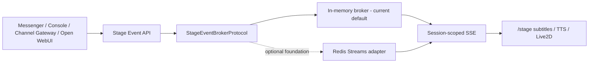

# EchoBot Stage Event Broker

## 中文版

### Runtime contract

### 共用事件規則

| 項目 | 規則 |
|---|---|
| Scope | trusted user storage key + normalized Session |
| Cursor | SSE `Last-Event-ID` / broker `after_event_id` |
| Event size | text 8 KiB、metadata 4 KiB、directive 256 chars |
| Queue pressure | bounded queue，滿時丟棄最舊事件並累計 drop count |
| History | bounded retention；unknown/evicted cursor 重播目前保留事件 |
| Heartbeat | broker-defined bounded interval |
| Rendering | Stage 使用 text-safe rendering；final event 才觸發最終 TTS |

### In-memory broker

- 目前 `create_app` 的正式預設。
- 每個 user/session 有獨立 history 與 subscriber set。
- channel 數量有上限；優先 LRU 淘汰沒有 subscriber 的 channel。
- 所有 channel 都有 subscriber 時，新增 channel 會明確拒絕，不做無界成長。
- 適用單 process / 單 worker；不宣稱跨 worker delivery。

### Redis Streams adapter

- 每個 user/session 產生獨立 SHA-256 component key；Redis key 不含原始 email 或 Session name。
- 每個 stream 個別執行 exact `MAXLEN` 與 positive TTL，publish 時刷新 expiry。
- 支援 Redis stream id cursor replay、lazy client factory 與 async subscription。
- 已加入 runtime selector：`ECHOBOT_STAGE_BROKER=memory|redis`。Redis mode 必須提供 `ECHOBOT_STAGE_REDIS_URL`，不會靜默切回 memory。
- async Redis client 已鎖定在 requirements；目前有 fake-client contract tests，但尚未做真 Redis 跨 process/load/reconnect/TTL/tenant isolation 驗收。

### 升級 Gate

1. 在真 Redis 上驗證兩個 app process 的 publish/subscribe、cursor reconnect、TTL、retention 與 tenant isolation。
2. 驗證 Redis unavailable 時的 degraded-mode 決策；不可靜默切回 memory 造成跨 worker 訊息分裂。
3. 只有完成上述 Gate 才可把 Redis production acceptance 標為 `Done`。

## English version

### Runtime Contract

Producers publish through the Stage Event API and the `StageEventBrokerProtocol`. The current application default is the bounded in-memory implementation. A Redis Streams adapter exists as an optional foundation. Both feed Session-scoped SSE consumed by `/stage` for subtitles, TTS, and Live2D state.

### Shared Rules

| Item | Rule |
|---|---|
| Scope | trusted-user storage key plus normalized Session |
| Cursor | SSE `Last-Event-ID` / broker `after_event_id` |
| Event size | 8 KiB text, 4 KiB metadata, 256-character directives |
| Queue pressure | bounded queue; drop oldest and count drops |
| History | bounded retention; unknown/evicted cursors replay retained events |
| Heartbeat | broker-defined bounded interval |
| Rendering | text-safe Stage rendering; final event triggers final TTS |

### Current In-Memory Default

Each user/session has independent history and subscribers. Channel count is bounded with idle LRU eviction, and capacity is rejected when every channel is active. This implementation is for one process/worker and does not claim cross-worker delivery.

### Redis Adapter And Remaining Gates

Redis uses separate SHA-256-derived keys per user/session, exact per-stream `MAXLEN`, a positive TTL refreshed on publish, stream-id cursor replay, and lazy async clients. The async Redis dependency is pinned, and the runtime selector plus fail-closed memory/multi-worker checks are implemented. Current evidence is still fake-client contract testing only. Before production activation, run real two-process Redis isolation/reconnect/load tests and document the unavailable/degraded-mode policy. Silent fallback to memory is not acceptable because it would split events between workers.
