# EchoBot Architecture And Data Flow - 2026-05-09

## 中文版

### 範圍

本文描述目前 EchoBot Web/Mobile 本機開發版的主要架構與資料流，重點是檢查「Session 為核心」是否清楚、前台/中台/後台/通訊入口是否分工合理，以及哪些邊界仍需要繼續重構。

已核對的程式入口：

- `echobot/app/create_app.py`
- `echobot/app/runtime.py`
- `echobot/app/services/user_scoped_runtime.py`
- `echobot/app/services/session_runtime_context.py`
- `echobot/app/routers/*.py`
- `echobot/app/web_pages.py`

### 產品入口

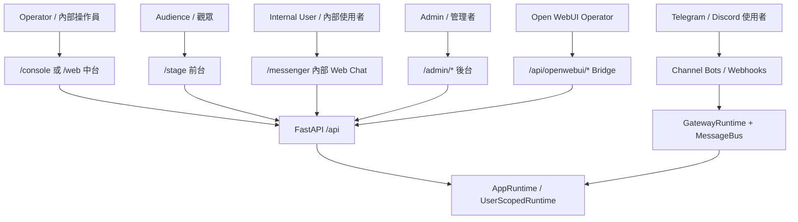

設計分工：

- `/stage`：正式展示畫面，只負責角色、字幕、TTS、Live2D、背景與前台狀態。
- `/console`：中台測試與操作介面，以 Session 為主，變更應只影響目前 Session 與前台，不寫回後台設定。
- `/messenger`：內部 Web Chat，以 Session 選擇為核心，不需要綁定 Telegram/Discord。
- `/admin/*`：後台設定中心，管理 Models、Voice Models、Live2D、Characters、Sessions、Channels、OpenWebUI bridge。
- Telegram/Discord：外部入口，只把訊息路由到 Session，不應成為核心資料模型。

### 系統架構

```mermaid
flowchart TD
  subgraph Browser["Browser / Mobile"]
    StagePage["/stage"]
    ConsolePage["/console / /web"]
    MessengerPage["/messenger"]
    AdminPages["/admin/*"]
  end

  subgraph FastAPI["FastAPI App"]
    Auth["Trusted User Middleware"]
    PageRoutes["Static Web Page Routes"]
    SessionRouter["sessions router"]
    ChatRouter["chat router"]
    StageRouter["stage router"]
    AdminRouters["models / voice / live2d / characters / channels"]
    WebRouter["web ASR/TTS/Live2D router"]
    OpenWebUIRouter["openwebui bridge router"]
  end

  subgraph Runtime["Runtime Layer"]
    AppRuntime["AppRuntime owner runtime"]
    UserRuntime["UserScopedRuntime per trusted user"]
    UserFactory["UserRuntimeFactory"]
    Bus["MessageBus"]
    Gateway["GatewayRuntime"]
    StageBroker["StageEventBroker"]
    StagePublisher["StageEventPublisher"]
  end

  subgraph Services["Application Services"]
    SessionService["GatewaySessionService / SessionLifecycleService"]
    ChatService["ChatService"]
    RoleService["RoleService"]
    CharacterSettings["CharacterProfileSettingsService"]
    ModelProfiles["ModelProfileService"]
    LLMModels["LLMModelService"]
    VoiceModels["VoiceModelService"]
    Live2DModels["Live2DModelService"]
    RuntimeContextSvc["SessionRuntimeContext service"]
    RuntimeOverrides["SessionRuntimeOverrideService"]
    ChannelService["ChannelService owner-scoped"]
    ChannelScope["channel_owner_scope helper"]
    WebConsole["WebConsoleService"]
  end

  subgraph Core["Core Runtime"]
    Coordinator["ConversationCoordinator"]
    Decision["Decision Engine"]
    Roleplay["Roleplay Engine"]
    Agent["Agent Runner / Tools / Jobs"]
    RuntimeControls["RuntimeControls"]
  end

  subgraph External["External Providers"]
    LLM["OpenAI-compatible / LiteLLM / Ollama / vLLM"]
    ASR["ASR Provider"]
    TTS["TTS Provider"]
    TG["Telegram"]
    DC["Discord"]
    OWUI["Open WebUI"]
  end

  subgraph Store["Local Persistent Data"]
    Sessions[".echobot/users/<user>/sessions or .echobot/sessions"]
    Roles[".echobot/roles/*.md"]
    ModelProfilesJson[".echobot/model_profiles.json"]
    RuntimeOverrideJson["session runtime overrides"]
    ChannelsJson[".echobot/channels.json owner scoped"]
    Attachments["attachments"]
    Live2DAssets["Live2D / background assets"]
    Jobs["jobs / traces / delivery state"]
  end

  Browser --> Auth --> PageRoutes
  Browser --> Auth --> SessionRouter
  Browser --> Auth --> ChatRouter
  Browser --> Auth --> StageRouter
  Browser --> Auth --> AdminRouters
  Browser --> Auth --> WebRouter
  OWUI --> OpenWebUIRouter

  SessionRouter --> SessionService
  ChatRouter --> ChatService
  StageRouter --> StageBroker
  AdminRouters --> LLMModels
  AdminRouters --> VoiceModels
  AdminRouters --> Live2DModels
  AdminRouters --> CharacterSettings
  AdminRouters --> ChannelScope --> ChannelService
  WebRouter --> WebConsole

  AppRuntime --> UserFactory --> UserRuntime
  AppRuntime --> Bus --> Gateway
  Gateway --> ChatService
  Gateway --> StagePublisher --> StageBroker

  ChatService --> Coordinator
  Coordinator --> Decision
  Coordinator --> Roleplay
  Coordinator --> Agent
  Coordinator --> LLM
  WebConsole --> ASR
  WebConsole --> TTS
  ChannelService --> TG
  ChannelService --> DC
  OpenWebUIRouter --> OWUI

  SessionService --> Sessions
  RoleService --> Roles
  CharacterSettings --> Roles
  CharacterSettings --> ModelProfilesJson
  ModelProfiles --> ModelProfilesJson
  LLMModels --> ModelProfilesJson
  VoiceModels --> ModelProfilesJson
  Live2DModels --> ModelProfilesJson
  RuntimeOverrides --> RuntimeOverrideJson
  ChannelService --> ChannelsJson
  ChatService --> Jobs
  WebConsole --> Live2DAssets
  WebConsole --> Attachments
```

### Session 核心資料模型

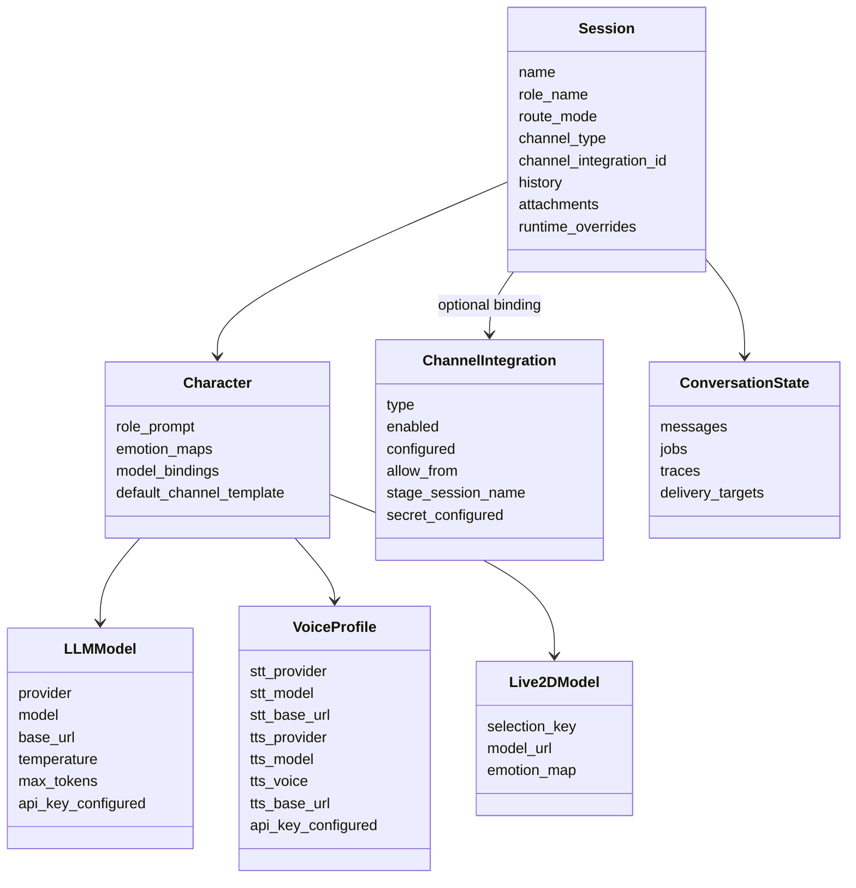

核心原則：

- Runtime 的入口是 `Session`，不是 Bot，也不是 Channel。
- `Character` 是可重用的互動單元，包含 prompt、模型、語音、Live2D 與預設通訊模板。
- `ChannelIntegration` 是外部入口與憑證設定，owner-scoped，不應切成每個 trusted user 自己一份。
- `/console` 的 runtime override 是目前 Session 的操作狀態，不應寫回 `/admin` 的永久設定。

### DFD Level 0

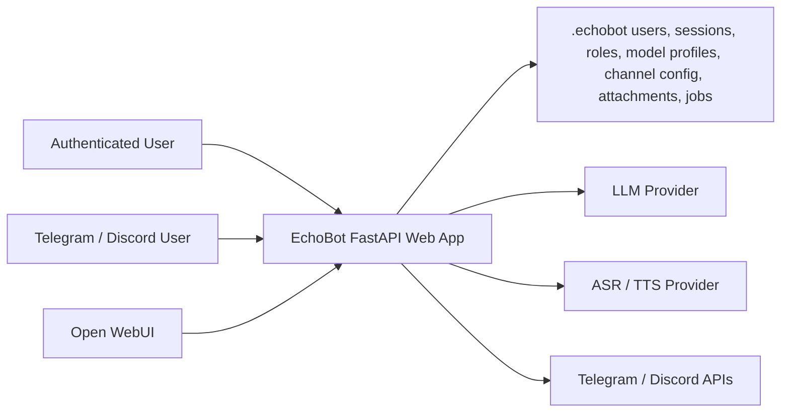

資料分類：

- 高敏感：API keys、bot tokens、OpenWebUI bridge token、trusted user header、channel webhook secrets。
- 中敏感：session history、attachments、ASR text、job traces、role prompts。
- 低敏感：UI language、display mode、stage layout state。
- 公開但需完整性：static web assets、vendored Live2D runtime、builtin Live2D/background assets。

### DFD Level 1

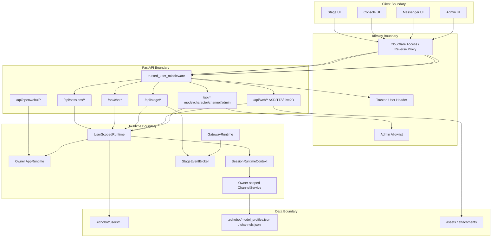

### 主要資料流 1：Console 套用目前 Session 的前台 runtime

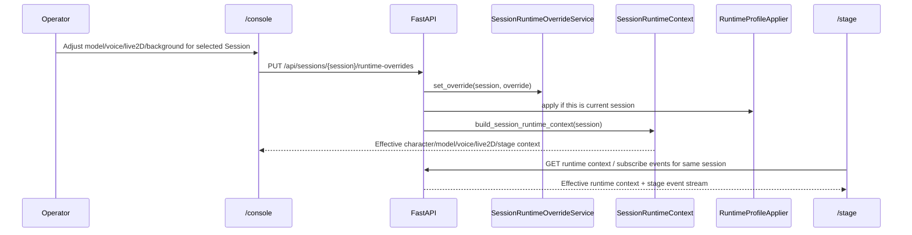

檢查點：

- 中台 runtime override 應該只影響目前 Session。
- 不應改掉 `/admin/models`、`/admin/voice-models`、`/admin/live2d` 的永久 profile。
- Stage 必須用同一個 session context 才會與 Console 同步。

### 主要資料流 2：Messenger 內部聊天

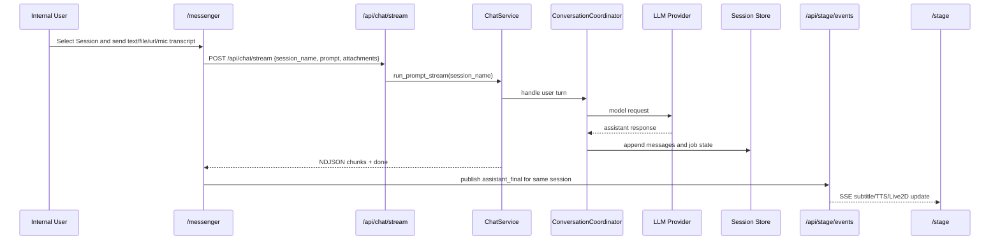

檢查點：

- Messenger 不需要選 Telegram/Discord。
- Messenger 應只選 Session。
- 若需要前台同步，必須發布同一個 session 的 stage event。

### 主要資料流 3：Telegram / Discord 外部入口

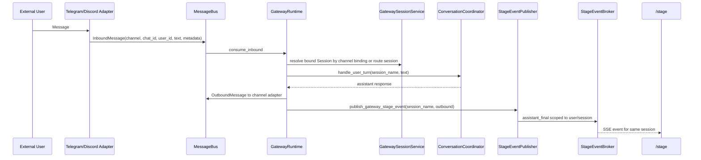

檢查點：

- Channel 是入口，不是核心。
- Session binding 決定 Telegram/Discord 訊息進哪個對話。
- Stage 顯示應跟正式外部互動同步。
- Channel credentials 走 owner-scoped `ChannelService`，不寫入 user-scoped runtime。

### 主要資料流 4：Open WebUI Bridge

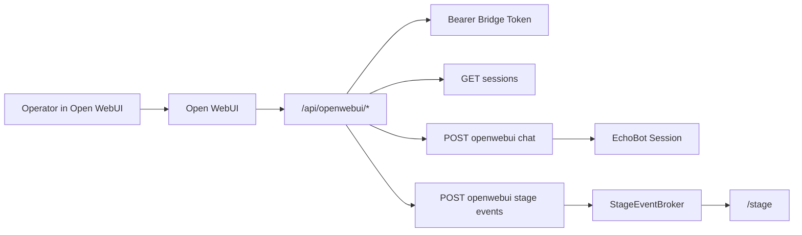

檢查點：

- Open WebUI 是操作員工作台，不取代 `/stage`。
- Bridge 應只暴露窄 API，不應暴露全站 OpenAPI。
- 預設 chat-only，agent/tool mode 應另有顯式開關與審核。

### Trust Boundaries

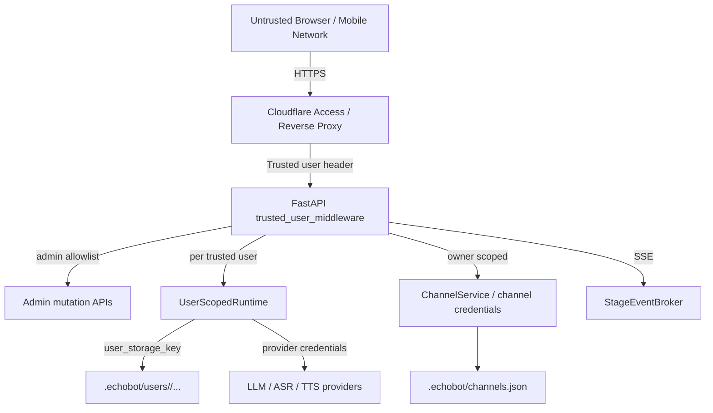

安全檢查重點：

- trusted-user mode 開啟時，受保護 route 缺可信 header 應拒絕。
- admin mutation API 應再經 admin allowlist。
- user-scoped session/history/attachments/jobs 不應互看。
- channel credentials owner-scoped，但 API 回應必須 redacted。
- Stage event broker key 必須包含 user/session scope。
- Messenger 不應預設觸發高風險 agent tools。

### 目前落地狀態

| 區塊 | 狀態 | 備註 |
|---|---|---|
| Session 為 runtime 核心 | 已完成目前 application slice | `SessionApplicationService` 已存在，sessions router 已委派 service |
| Character 綁 LLM/Voice/Live2D | 部分完成 | 後台 API/UI 已拆，但資料仍透過 compatibility model profile store |
| Channel owner scoped | 已完成一輪 | `channel_owner_scope` 已避免 user runtime 假裝持有 channel service |
| Runtime context service | 已完成一輪 | `session_runtime_context.py` 已抽出 |
| Stage event broker | 已完成基礎 | SSE + bounded event model 已存在 |
| Telegram / Discord gateway | 可跑，需 E2E 持續驗收 | health 顯示 running，但正式活動前仍需真訊息回歸 |
| Open WebUI bridge | 部分完成 | Narrow API 與 smoke path 已存在；正式 UI/長跑驗收仍需環境證據 |
| PostgreSQL schema | 規劃/文件存在 | 目前 runtime 仍以 `.echobot` JSON/files 為主 |

### 下一步重構順序

1. `character_profiles.py` 拆分
   - Character CRUD
   - package import/export
   - model/voice/live2D/channel default binding

2. `runtime_model_repositories.py` 拆分
   - Base repository
   - LLM repository
   - Voice repository
   - Live2D repository

3. UIUX 資料流檢查
   - Console session selector 是否為主入口。
   - Stage 是否只呈現正式互動。
   - Admin 是否只做持久設定。

4. Production persistence and broker
   - PostgreSQL runtime repositories/migration。
   - Redis/pubsub before multi-worker deployment。

## English version

### Scope

This document describes the current EchoBot Web/Mobile local development architecture and data flow. The main review goals are to verify that Session is the runtime core, UI entrypoints are separated clearly, and remaining refactor boundaries are visible.

Verified code entrypoints:

- `echobot/app/create_app.py`
- `echobot/app/runtime.py`
- `echobot/app/services/user_scoped_runtime.py`
- `echobot/app/services/session_runtime_context.py`
- `echobot/app/routers/*.py`
- `echobot/app/web_pages.py`

### Product Entrypoints

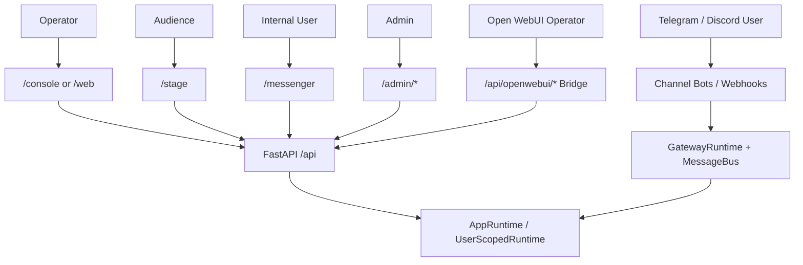

Entrypoint ownership:

- `/stage`: official display surface for character, subtitles, TTS, Live2D, background, and stage state.
- `/console`: operator testing and runtime controls, scoped to the selected Session.
- `/messenger`: internal web chat, session-only, no channel binding required.
- `/admin/*`: persistent configuration center for models, voice, Live2D, characters, sessions, channels, and Open WebUI bridge.
- Telegram/Discord: external entrypoints that route messages into Sessions.

### System Architecture

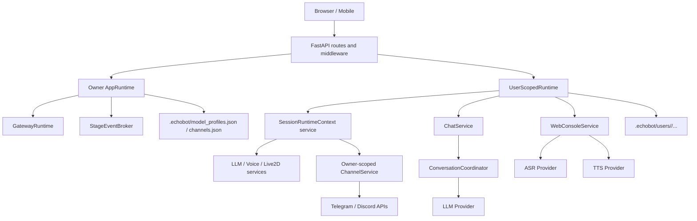

### Session-Centered Data Model

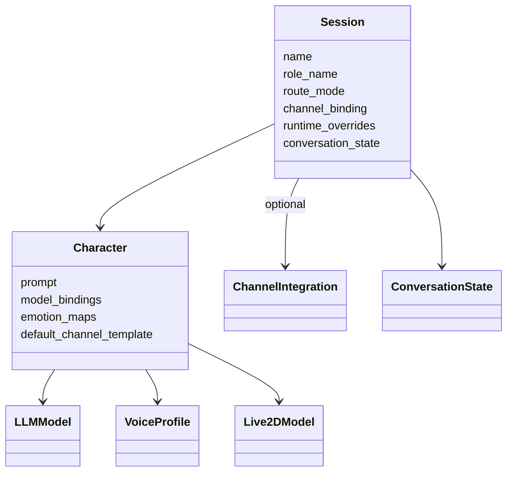

### DFD Level 0

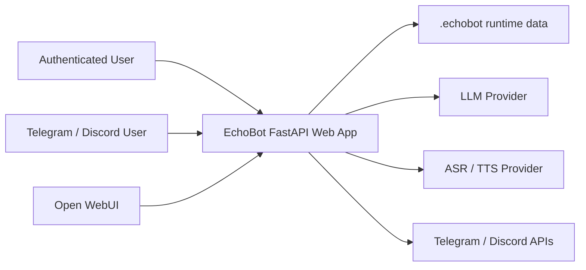

### Key Flows

Console session override:

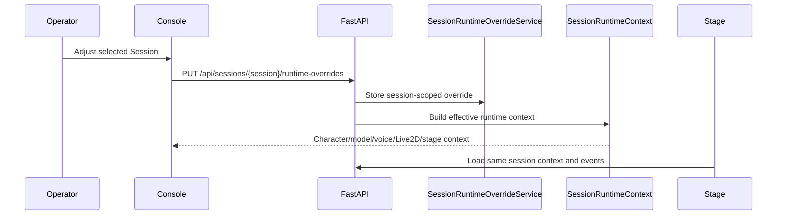

External channel flow:

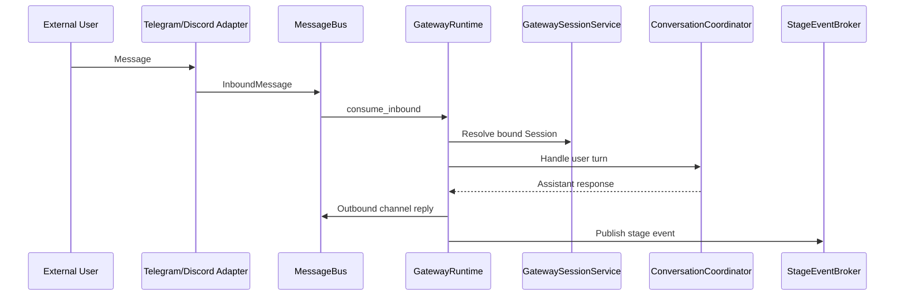

### Trust Boundaries

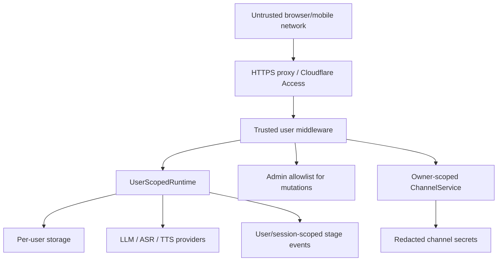

### Current State

| Area | Status | Notes |
|---|---|---|
| Session-centered runtime | Current application slice complete | `SessionApplicationService` exists and the sessions router delegates to it |
| Character model/voice/Live2D binding | Partially done | Uses compatibility model profile storage |
| Owner-scoped channel service | Done in one slice | User runtimes no longer expose `channel_service` directly |
| Runtime context service | Done in one slice | `session_runtime_context.py` now owns effective context composition |
| Stage event broker | Basic complete | SSE broker exists |
| Telegram / Discord gateway | Running, needs repeated E2E | Health shows adapters running |
| Open WebUI bridge | Partial | Narrow APIs and smoke paths exist; formal UI/long-run evidence remains environment-specific |
| PostgreSQL | Planned | Current runtime still uses `.echobot` files |

### Recommended Refactor Order

1. Split `character_profiles.py` into character CRUD, package import/export, and runtime binding services.
2. Split `runtime_model_repositories.py` into smaller repositories.
3. Recheck UI data flow for Console, Stage, Messenger, and Admin.
4. Add PostgreSQL runtime repositories/migration and Redis/pubsub before multi-worker deployment.
