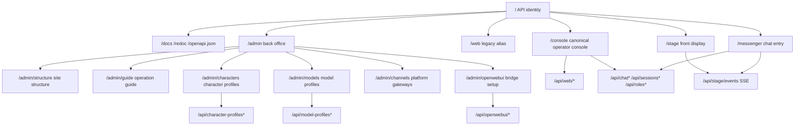

# EchoBot Web Site Structure - 2026-05-02

## 中文版

### 目的

本文件固定 EchoBot Web 入口、頁面責任、`/console` 內部分區、Admin 子頁面與 API namespace 邊界。目標是讓後續加入模型設定、Open WebUI、通訊平台與本地模型服務時，不把所有能力塞回單一頁面。

### 第一層頁面

| 層級 | Route | 頁面責任 | 不應承擔 |
|---|---|---|---|
| 前台 | `/stage?session_name=<name>` | 純顯示角色、字幕、TTS、Live2D lip sync，接收 stage event 的 emotion/expression/motion，並可選已設定通訊平台 target | 不放設定、不做工具操作 |
| 通訊 | `/messenger?session_name=<name>` | 輕量聊天入口，可從 Telegram/Discord 等已設定 target 選擇前台 session，將最終回覆與可選 stage directive 推到 Stage | 預設不直接觸發工具型 Agent |
| 中台 | `/console` | 操作員即時控制台，處理 session、角色卡、ASR/TTS、Live2D、jobs、CRON、HEARTBEAT | 不當文件庫或長期設定索引 |
| 舊 alias | `/web` | 舊入口，等價於 `/console` | 不新增新功能 |
| 後台 | `/admin` | 受保護索引、health、docs、設定與文件入口 | 不承擔即時舞台操作 |

### `/console` 內部分區

| 分區 | 內容 | 目的 |
|---|---|---|
| Stage panel | 連線狀態、session badge、active model profile、語言/顯示切換、Live2D stage、Live2D drawer | 操作員即時看到角色狀態 |
| 控制抽屜 | session list、role card list/editor | 切換或維護目前操作上下文 |
| Runtime settings | route mode、provider safety、ASR、TTS、Live2D、stage assets、CRON、HEARTBEAT | 改變目前 runtime 行為 |
| Conversation area | transcript、agent trace、attachments、microphone、send controls | 執行目前 session 的對話與工作 |

### Admin 子頁面

| Route | 類型 | 責任 |
|---|---|---|
| `/admin/structure` | 資訊架構 | 頁面地圖、Console 分區、API namespace 分組 |
| `/admin/guide` | Runbook | 操作方式、預期成果、故障跡象、排除流程 |
| `/admin/characters` | 角色設定 | 角色 prompt、模型 profile 綁定、TTS/ASR/Live2D 摘要、emotion-to-expression/motion map、單角色 package 匯入/匯出 |
| `/admin/models` | 設定頁 | 預設 A-E 並可持續新增的模型 profile、API key、地端模型 base URL |
| `/admin/channels` | 通訊平台 | Telegram / Discord 設定、Stage 前台同步、smoke readiness，並保留 QQ/LINE/WhatsApp gateway 邊界 |
| `/admin/openwebui` | Bridge 設定 | Open WebUI narrow tool bridge 狀態與接線說明 |

### API 分組

| Namespace | 對應頁面 | 責任 |
|---|---|---|
| `/api/web/*` | `/console` | Web config、runtime、Live2D、stage backgrounds、TTS、ASR/WebSocket |
| `/api/chat*` | `/console`、`/messenger` | chat、stream、jobs、trace、cancel/retry |
| `/api/sessions*` | `/console`、`/messenger`、`/stage` | session lifecycle 與 current session |
| `/api/stage/events` | `/stage`、`/messenger` | user/session-scoped stage event publish 與 SSE subscribe；支援字幕、`character_state`、emotion、expression、motion，並可依 session 角色補上 emotion map |
| `/api/character-profiles*` | `/admin/characters` | 角色 prompt、模型 profile 綁定、emotion map 與單角色 package 匯入/匯出的聚合 API |
| `/api/model-profiles*` | `/admin/models`、`/console` | per-user model profile CRUD、啟用與 runtime apply |
| `/api/openwebui/*` | `/admin/openwebui`、Open WebUI | bearer-token bridge 與窄 OpenAPI tools |
| `/api/channels/*` | `/admin/channels` | 外部通訊平台設定、Stage 同步設定、狀態與 admin-gated smoke checks |
| `/api/roles*`、`/api/attachments*`、`/api/cron*`、`/api/heartbeat*` | `/console` | 支援角色卡、檔案、排程與週期任務 |

### Route 規則

- 新增即時操作能力時，優先放 `/console`，並維持目前 session scope。
- 新增長期設定或文件時，放 `/admin/<topic>`。
- 新增展示能力時，優先放 `/stage`，但 Stage 不取得設定權限。
- 新增外部通訊平台時，先建立 `/admin/channels` 設定頁，再接 runtime adapter；正式互動入口的 assistant 回覆預設要可同步到 `/stage`。
- `/web` 僅保留相容；新文件與導覽以 `/console` 為 canonical route。

### Site Map

## English version

### Purpose

This document fixes the EchoBot Web entrypoints, page responsibilities, `/console` internal sections, Admin child pages, and API namespace boundaries. The goal is to avoid pushing every future capability back into one page as model settings, Open WebUI, communication platforms, and local model services are added.

### Top-Level Pages

| Layer | Route | Responsibility | Should not do |
|---|---|---|---|
| Front display | `/stage?session_name=<name>` | Character display, subtitles, TTS, Live2D lip sync, stage-event emotion/expression/motion, and configured messaging target selection | No settings or tool operations |
| Communication | `/messenger?session_name=<name>` | Lightweight chat entry that can select the Stage session from configured Telegram/Discord-style targets, then publish final replies plus optional stage directives to Stage | No direct tool-capable Agent by default |
| Console | `/console` | Real-time operator console for sessions, role cards, ASR/TTS, Live2D, jobs, CRON, HEARTBEAT | Not a documentation library or long-term settings index |
| Legacy alias | `/web` | Existing alias for `/console` | No new feature ownership |
| Admin | `/admin` | Protected index for health, docs, settings, and documentation pages | No live stage operation |

### `/console` Internal Sections

| Section | Content | Purpose |
|---|---|---|
| Stage panel | Connection state, session badge, active model profile, language/display switches, Live2D stage, Live2D drawer | Let the operator see the character state immediately |
| Control drawers | Session list and role card list/editor | Switch or maintain current operating context |
| Runtime settings | Route mode, provider safety, ASR, TTS, Live2D, stage assets, CRON, HEARTBEAT | Change current runtime behavior |
| Conversation area | Transcript, agent trace, attachments, microphone, send controls | Run the current session conversation and work |

### Admin Child Pages

| Route | Type | Responsibility |
|---|---|---|
| `/admin/structure` | Information architecture | Page map, Console sections, API namespace grouping |
| `/admin/guide` | Runbook | Operation flow, expected results, failure signs, troubleshooting |
| `/admin/characters` | Character setup | Role prompt, model profile binding, TTS/ASR/Live2D summary, emotion-to-expression/motion maps, and single-character package import/export |
| `/admin/models` | Settings page | default A-E plus user-created model profiles, API keys, local model base URLs |
| `/admin/channels` | Messaging gateways | Telegram / Discord settings, Stage frontend mirroring, smoke readiness, plus QQ/LINE/WhatsApp gateway boundaries |
| `/admin/openwebui` | Bridge setup | Open WebUI narrow tool bridge status and wiring notes |

### API Groups

| Namespace | Page | Responsibility |
|---|---|---|
| `/api/web/*` | `/console` | Web config, runtime, Live2D, stage backgrounds, TTS, ASR/WebSocket |
| `/api/chat*` | `/console`, `/messenger` | Chat, stream, jobs, trace, cancel/retry |
| `/api/sessions*` | `/console`, `/messenger`, `/stage` | Session lifecycle and current session |
| `/api/stage/events` | `/stage`, `/messenger` | User/session-scoped stage event publish and SSE subscribe; supports subtitles, `character_state`, emotion, expression, motion, and role-based emotion map enrichment |
| `/api/character-profiles*` | `/admin/characters` | Composed API for role prompts, model profile bindings, emotion maps, and single-character package import/export |
| `/api/model-profiles*` | `/admin/models`, `/console` | Per-user model profile CRUD, activation, runtime apply |
| `/api/openwebui/*` | `/admin/openwebui`, Open WebUI | Bearer-token bridge and narrow OpenAPI tools |
| `/api/channels/*` | `/admin/channels` | External communication platform config, Stage mirroring config, status, and admin-gated smoke checks |
| `/api/roles*`, `/api/attachments*`, `/api/cron*`, `/api/heartbeat*` | `/console` | Supporting role cards, files, schedules, and periodic tasks |

### Route Rules

- Put new real-time operation features in `/console`, scoped to the current session.
- Put long-term settings or documentation in `/admin/<topic>`.
- Put display-only features in `/stage`; Stage should not gain settings authority.
- Add external communication platforms through `/admin/channels` first, then wire runtime adapters; assistant replies from production interaction entries should be able to mirror to `/stage` by default.
- Keep `/web` only for compatibility; use `/console` as the canonical route in docs and navigation.

### Site Map

