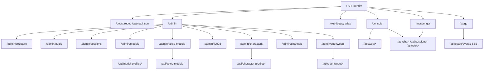

# EchoBot Web Site Structure - 2026-05-05

## 中文版

### 目的

建立一套以 Session 為核心的操作理解：先完成資源設定，再綁定角色，最後透過 `Console`、`Messenger`、`Stage` 做 session 測試。`Channels` 只負責進入口，不是核心控制面；Open WebUI bridge 是操作員工具接口。

### Session 流程

1. Admin 設定 LLM：到 `/admin/models` 建立可用的 LLM profile。
2. Admin 設定 Voice：到 `/admin/voice-models` 建立 STT/TTS profile。
3. Admin 設定 Live2D：到 `/admin/live2d` 建立視覺 profile。
4. Admin 角色綁定：到 `/admin/characters` 將 LLM/Voice/Live2D 綁到同一角色設定。
5. Session 測試：到 `/admin/sessions` 建立/選擇 session，接著到 `/console` 選角色與可選 channel，最後用 `/messenger?session_name=<name>` 與 `/stage?session_name=<name>` 驗證。
6. 通道狀態確認：`/admin/channels` 僅做入口管理， Telegram / Discord 為目前可測試通道；LINE、WhatsApp、QQ 仍規劃中。
7. Open WebUI bridge：在 `/admin/openwebui` 僅作為操作員工具接口設定與狀態檢視。

### 第一層頁面

| 層級 | Route | 頁面責任 | 不應承擔 |
|---|---|---|---|
| 前台 | `/stage?session_name=<name>` | 單一 session 的角色顯示、字幕、TTS、Live2D lip sync（結果輸出） | 不做即時模型/角色控制 |
| 通訊 | `/messenger?session_name=<name>` | 輕量聊天輸入；將最終回覆同步到 Stage | 不承擔 Console 的即時控制 |
| 中台 | `/console` | 會話層即時操作台：角色卡、模型、語音、Live2D、runtime 切換 | 不放設計文件與長期設定索引 |
| 後台 | `/admin` | 受保護入口：模型/語音/Live2D、角色、通道、文件與設置 | 不做即時對話控制 |

### `/console` 內部

| 分區 | 內容 | 目的 |
|---|---|---|
| Session panel | 連線狀態、session badge、角色/模型狀態、語言、Live2D 顯示 | 讓操作員看到會話目前狀態 |
| Control drawers | session 清單、角色卡選擇 | 切換當前會話控制上下文 |
| Settings groups | route mode、provider 切換、ASR、TTS、Live2D、CRON、HEARTBEAT | 控制當前 session 的執行行為 |
| Conversation area | transcript、attachments、麥克風、發送 | 驗證 session 內訊息流程 |

### Admin 子頁面

| Route | 類型 | 責任 |
|---|---|---|
| `/admin/structure` | 架構文件 | 頁面地圖、Console 分區、API namespace |
| `/admin/guide` | 操作說明 | Session 流程與對應檢核 |
| `/admin/sessions` | 會話維運 | 會話建立/重命名/刪除與進入 Console |
| `/admin/models` | 模型設定 | LLM profile 管理 |
| `/admin/voice-models` | 語音設定 | STT/TTS profile 管理 |
| `/admin/live2d` | 視覺設定 | Live2D 目錄與視覺 profile 管理 |
| `/admin/characters` | 角色設定 | 角色綁定 LLM/Voice/Live2D |
| `/admin/channels` | 通道入口 | Telegram/Discord 測試設定；LINE/WhatsApp/QQ 規劃中 |
| `/admin/openwebui` | 工具接口 | Open WebUI bridge 接線與工具白名單 |

### API 分組

| Namespace | 對應頁面 | 職責 |
|---|---|---|
| `/api/web/*` | `/console` | Web config、runtime、Live2D、TTS、ASR、WebSocket |
| `/api/chat*` | `/console`、`/messenger` | 對話、stream、jobs、trace |
| `/api/sessions*` | `/console`、`/messenger`、`/stage` | session lifecycle 與當前 session |
| `/api/stage/events` | `/stage`、`/messenger` | session-scoped 字幕與舞台事件推送 |
| `/api/character-profiles*` | `/admin/characters` | 角色定義、prompt、角色綁定 |
| `/api/model-profiles*` | `/admin/models`、`/console` | model profile CRUD 與啟用 |
| `/api/voice-models` | `/admin/voice-models` | STT/TTS profile 管理 |
| `/api/openwebui/*` | `/admin/openwebui`、Open WebUI | 操作員工具 API bridge |
| `/api/channels/*` | `/admin/channels` | 通道設定、狀態與 smoke 準備 |
| `/api/roles*`、`/api/attachments*`、`/api/cron*`、`/api/heartbeat*` | `/console` | 角色卡、檔案、排程、HEARTBEAT |

### 規則

- Session-based 操作保持 `/admin`（設定）與 `/console`（即時操作）分離；`Messenger`/`Stage`僅作消息入口與輸出。
- 通道是進入口，不是核心流程；先用 Telegram/Discord 驗證，其他平台暫停在規劃清單。
- Open WebUI bridge 只在需要工具接口時使用，與一般會話測試路徑分離。

### Site Map

## English version

### Purpose

Define a session-centered operation flow: set up resources first, bind them into a character, then test with `Console`, `Messenger`, and `Stage`. Channels are entry points, not the core control path. Open WebUI bridge is an operator tool interface.

### Session flow

1. Configure LLM in `/admin/models`.
2. Configure voice settings in `/admin/voice-models`.
3. Configure Live2D in `/admin/live2d`.
4. In `/admin/characters`, bind LLM profile + voice profile + Live2D profile into one character.
5. Create/select a session in `/admin/sessions`, choose role and optional channel in `/console`, then validate through `/messenger?session_name=<name>` and `/stage?session_name=<name>`.
6. Channel status is managed in `/admin/channels`: Telegram and Discord are smoke-ready; LINE, WhatsApp, QQ remain planned.
7. Use `/admin/openwebui` only as the operator tool interface for bridge setup and status.

### Top-Level Pages

| Layer | Route | Responsibility | Should not do |
|---|---|---|---|
| Front display | `/stage?session_name=<name>` | Single-session output: character, subtitles, TTS, and Live2D lip sync | No live model/character controls |
| Communication | `/messenger?session_name=<name>` | Lightweight input path; publishes final assistant output to Stage | No runtime control |
| Operator console | `/console` | Session-centered live control: role card, model, voice, Live2D, and runtime toggles | Not a docs/config index |
| Admin | `/admin` | Protected hub for setup pages and documentation | Not live session control |

### `/console` Internal Sections

| Section | Content | Purpose |
|---|---|---|
| Session panel | connection state, session badge, character/model status, language, Live2D view | View active session state |
| Control drawers | session list and character card selection | Keep current session context |
| Settings groups | route mode, provider switching, ASR/TTS, Live2D, CRON, HEARTBEAT | Change current session behavior |
| Conversation area | transcript, attachments, mic, send controls | Run and inspect session messages |

### Admin Child Pages

| Route | Type | Responsibility |
|---|---|---|
| `/admin/structure` | Information architecture | Page map, Console sections, API namespace grouping |
| `/admin/guide` | Runbook | Session flow and operation reference |
| `/admin/sessions` | Session maintenance | Create, rename, delete, and open-in-console checks |
| `/admin/models` | LLM setup | LLM profile management |
| `/admin/voice-models` | Speech setup | STT/TTS profile management |
| `/admin/live2d` | Visual setup | Live2D catalog and profile management |
| `/admin/characters` | Character setup | Bind LLM, voice, and Live2D into one character |
| `/admin/channels` | Channel entrypoints | Telegram/Discord smoke setup; LINE/WhatsApp/QQ planned |
| `/admin/openwebui` | Tool bridge | Open WebUI interface status and operator tool wiring |

### API Groups

| Namespace | Page | Responsibility |
|---|---|---|
| `/api/web/*` | `/console` | Web config, runtime, Live2D, TTS, ASR, WebSocket |
| `/api/chat*` | `/console`, `/messenger` | chat, stream, jobs, trace |
| `/api/sessions*` | `/console`, `/messenger`, `/stage` | session lifecycle and current session |
| `/api/stage/events` | `/stage`, `/messenger` | user/session-scoped stage subtitle and event publishing |
| `/api/character-profiles*` | `/admin/characters` | character definition and bindings |
| `/api/model-profiles*` | `/admin/models`, `/console` | model profile CRUD and apply |
| `/api/voice-models` | `/admin/voice-models` | STT/TTS profile management |
| `/api/openwebui/*` | `/admin/openwebui`, Open WebUI | Operator tool bridge endpoint |
| `/api/channels/*` | `/admin/channels` | channel settings, status, and smoke readiness |
| `/api/roles*`, `/api/attachments*`, `/api/cron*`, `/api/heartbeat*` | `/console` | roles, files, schedules, heartbeat |

### Route rules

- Keep Admin (setup) and Console (live operation) separate; use Messenger/Stage only for input and output checks.
- Channels are entry points, not the control core. Use Telegram/Discord for current tests; keep LINE/WhatsApp/QQ in roadmap.
- Open WebUI bridge is for operator tool actions and should be tested separately from normal session-path checks.

### Site Map

